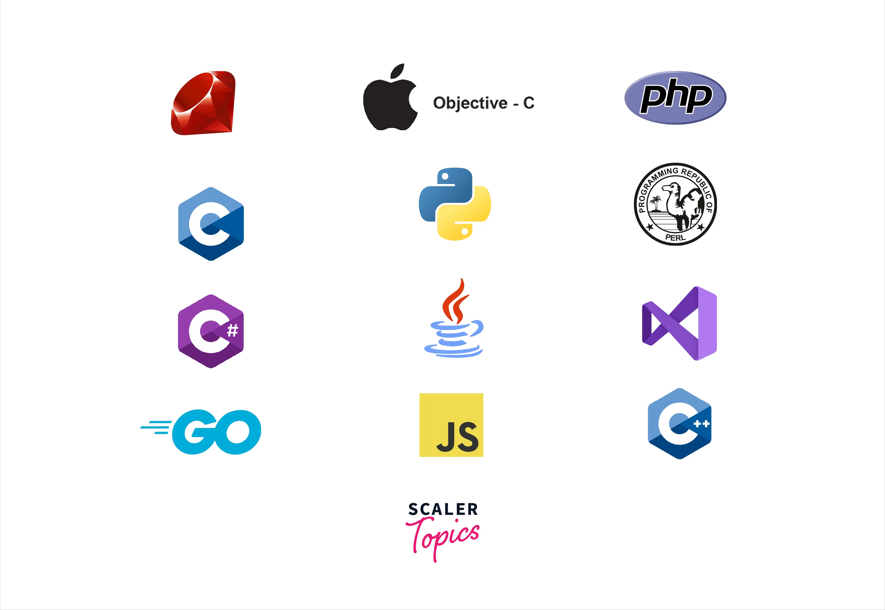
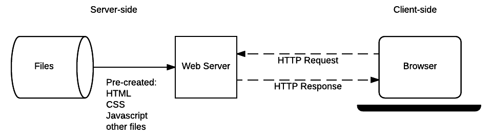
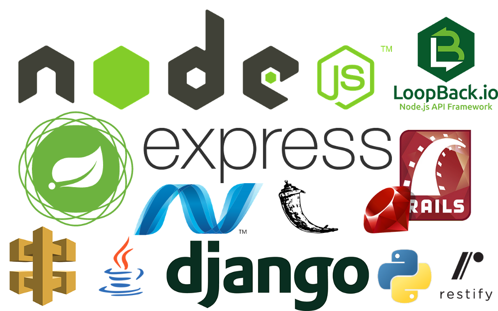
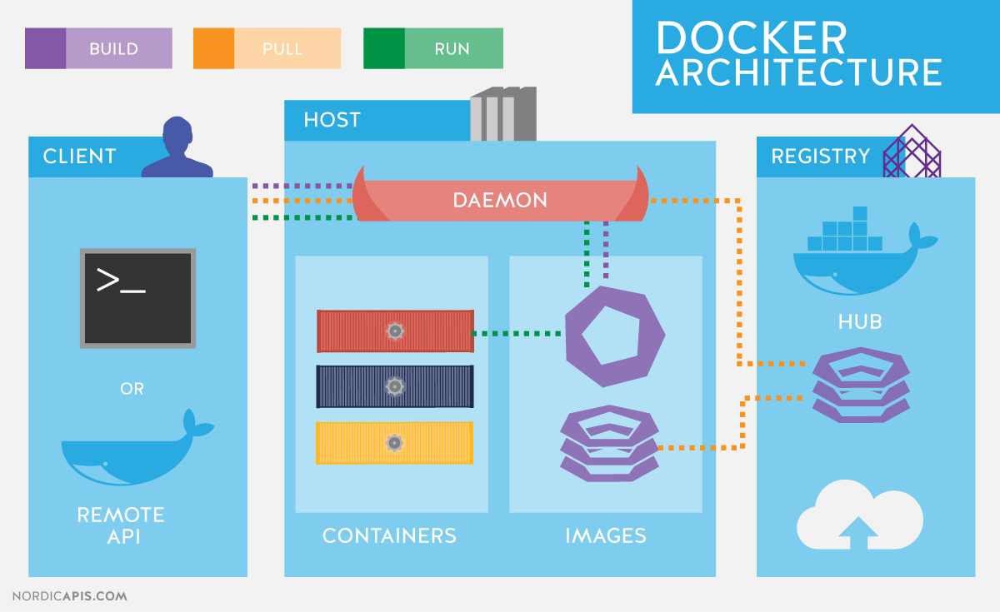

 # Backend Web Development

  

Backend web development focuses on the server-side of web applications. It involves handling requests from the frontend, processing them, interacting with databases, and sending the appropriate responses. Backend developers work with programming languages, frameworks, and databases to ensure the functionality and performance of the web application.

## Key Concepts in Backend Development

### 1. Server-Side Programming

  

Backend developers write the code that runs on the server, which processes the logic and responses that a frontend application requests.

- **Server-Side Scripting Languages** – Languages like PHP, Python, Ruby, Node.js, and Java are used to write backend code that runs on the server.

### 2. Databases

  

Databases store the information that a web application needs to function. They can be relational (SQL) or non-relational (NoSQL).

- **Relational Databases** – Examples include MySQL, PostgreSQL, and SQLite. They store data in tables with rows and columns.
- **Non-Relational Databases** – Examples include MongoDB and CouchDB. They store data in a more flexible format, such as documents or key-value pairs.

### 3. API (Application Programming Interface)

  

Backend development often involves creating APIs that allow the frontend and other services to interact with the server and retrieve data.

- **RESTful APIs** – A common architectural style for building APIs that allows interaction through HTTP requests (GET, POST, PUT, DELETE).
- **GraphQL** – A query language for APIs, providing a more flexible way to interact with data compared to REST.

## **Backend Frameworks**

  

Backend frameworks make it easier for developers to build robust and scalable applications by providing pre-written code and best practices.

- **Node.js** – A JavaScript runtime built on Chrome’s V8 engine. It allows backend developers to use JavaScript for both frontend and backend development.
- **Django** – A high-level Python framework that promotes rapid development and clean, pragmatic design.
- **Ruby on Rails** – A web application framework written in Ruby that follows the model-view-controller (MVC) architecture.
- **Express.js** – A minimal and flexible Node.js web application framework that provides a robust set of features for web and mobile applications.

## **Backend Development Tools**


- **Text Editors** – Popular text editors for backend development include Visual Studio Code, Sublime Text, and Atom.
- **Version Control** – Git is used to track code changes and collaborate with other developers. GitHub or GitLab are platforms where code can be hosted.
- **Containerization and Deployment** – Tools like Docker and Kubernetes help package applications and deploy them in isolated environments.
- **Testing Frameworks** – Tools such as Mocha, Jest, and PyTest are used for unit testing and integration testing of backend applications.

## **Best Practices in Backend Development**

- **Security** – Ensure the security of your web application by using encryption (SSL/TLS), implementing proper authentication (OAuth, JWT), and avoiding common vulnerabilities (SQL injection, XSS).
- **Database Optimization** – Use indexes, proper data types, and query optimization to ensure fast and efficient access to data.
- **Scalability** – Design the backend to handle high loads by using caching, load balancing, and distributed databases.
- **Error Handling** – Proper error handling ensures that your application is robust and can recover gracefully from unexpected situations.

By following these best practices and leveraging the right frameworks and tools, backend developers can build scalable, secure, and high-performance web applications.

## **Common implementations in different backend programming languages:**

### Node.js

```javascript
const express = require('express');
const app = express();
const port = 3000;

app.get('/', (req, res) => {
    res.send('Hello, World!');
});

app.listen(port, () => {
    console.log(`Server running at http://localhost:${port}`);
});
```

### Python (Django)

```python
from django.http import HttpResponse

def hello_world(request):
    return HttpResponse("Hello, World!")
```

### PHP

```php
<?php
// Simple PHP script to send a response
echo "Hello, World!";
?>
```

## **Additional Resources**

### Informative Video

Here is an informative video on backend web development to help build your understanding.

[](https://www.youtube.com/watch?v=1oTuMPIwHmk)

### Articles

1. **[How to Become a Back-End Developer](https://www.coursera.org/articles/back-end-developer)**  
2. **[Beginner’s Guide to Back-End Development](https://www.upwork.com/resources/beginners-guide-back-end-development)**  
3. **[Backend Developer Roadmap](https://roadmap.sh/backend)**  