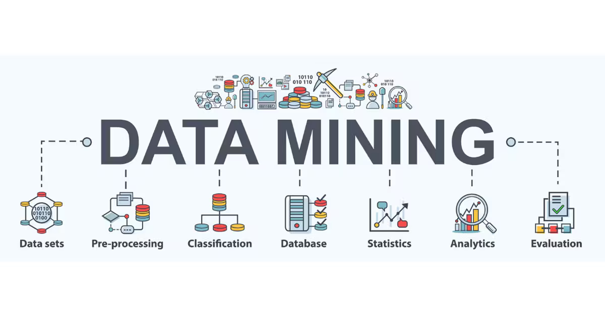
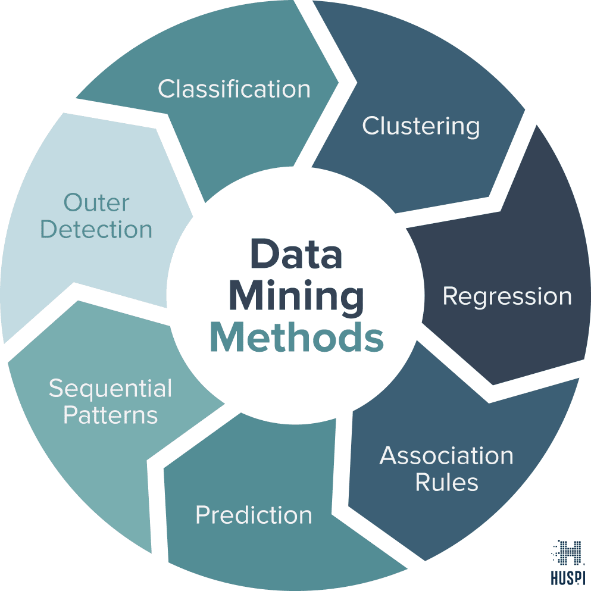
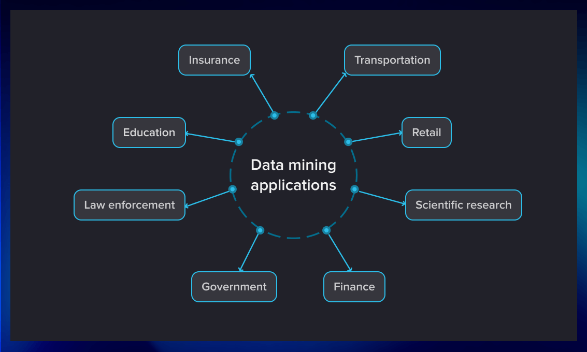
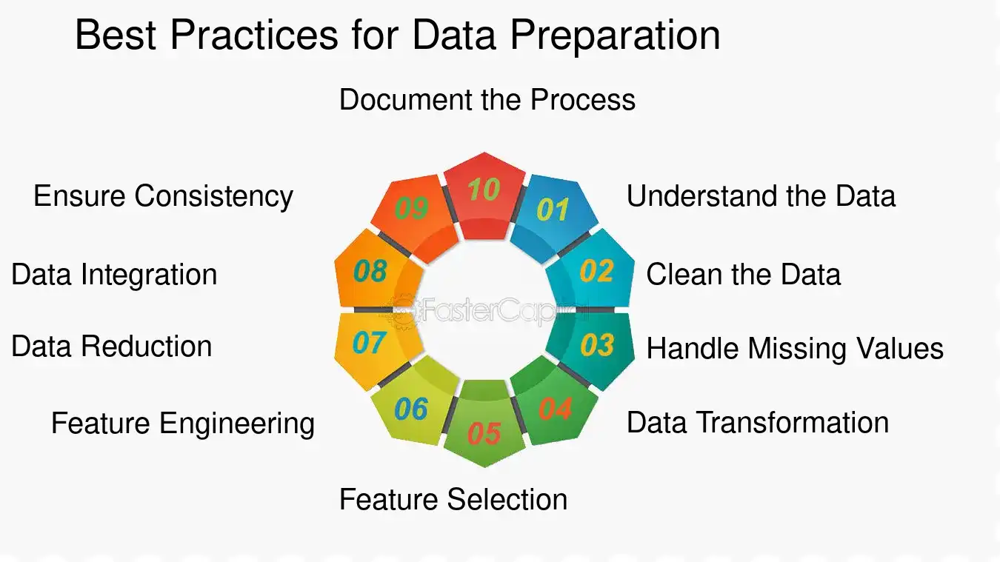

 # Data Mining



Data mining refers to the process of discovering patterns, trends, and useful information from large sets of data using various techniques such as statistical analysis, machine learning, and data visualization. It involves analyzing data from different perspectives and summarizing it into useful information, which can then be used to improve decision-making and predict future trends.  

## Types of Data Mining Techniques

 

### 1. Classification
Classification involves categorizing data into predefined classes or labels. This technique is often used in applications such as email spam detection, fraud detection, and medical diagnosis.  

**Example:** Decision trees, Support Vector Machines (SVM), and Naive Bayes classifiers.  

### 2. Clustering  
Clustering groups similar data points into clusters based on certain features, without predefined labels. It's useful for market segmentation, customer profiling, and anomaly detection.  

**Example:** K-means clustering, hierarchical clustering, and DBSCAN.  

### 3. Regression  
Regression analyzes relationships between variables to predict a continuous output. This technique is widely used in forecasting and risk assessment.  

**Example:** Linear regression, polynomial regression, and logistic regression.  

### 4. Association Rule Mining  
This technique finds relationships between different items in large datasets. It is commonly used in retail to find product associations in purchase data.  

**Example:** Apriori algorithm, Eclat algorithm.  

## **Applications of Data Mining**  

  

- **Business Intelligence** – Analyzes customer behavior and purchasing patterns to improve sales strategies.  
- **Healthcare** – Predicts disease outbreaks, diagnoses, and treatment outcomes.  
- **Finance** – Detects fraud, assesses credit risk, and analyzes investment trends.  
- **E-commerce** – Recommender systems and personalized product suggestions.  

## **Best Practices for Data Mining**  

  

- **Data Preprocessing** – Clean and preprocess data to remove noise and inconsistencies.  
- **Model Validation** – Regularly validate models with new data to ensure accuracy and reliability.  
- **Avoid Overfitting** – Ensure the model generalizes well to new, unseen data by avoiding overfitting to the training set.  
- **Use Cross-Validation** – Use cross-validation techniques to assess the performance of models and avoid bias.  

By applying effective data mining techniques and practices, businesses can unlock hidden patterns in data that lead to more informed decision-making and increased profitability.

## Common implementation in Python
```python
# Python using scikit-learn for classification
from sklearn.model_selection import train_test_split
from sklearn.ensemble import RandomForestClassifier
from sklearn.metrics import accuracy_score

# Load dataset
X, y = load_data()  # Assume load_data is a function that loads your dataset

# Split the data into training and testing sets
X_train, X_test, y_train, y_test = train_test_split(X, y, test_size=0.3, random_state=42)

# Initialize the classifier
clf = RandomForestClassifier()

# Train the model
clf.fit(X_train, y_train)

# Predict using the test set
y_pred = clf.predict(X_test)

# Evaluate the model's performance
print("Accuracy:", accuracy_score(y_test, y_pred))
```

## Additional Resources

### Informative Video
Here is an informative video on data mining to help build your understanding.

[](https://www.youtube.com/watch?v=7rs0i-9nOjo)

### Articles

1. **[How Data Mining Improves Business Decision Making](https://www.sas.com/en_us/insights/analytics/data-mining.html)** – SAS explains the role of data mining in business intelligence and decision-making.   
2. **[Data Mining Definition | TechTarget](https://www.techtarget.com/searchbusinessanalytics/definition/data-mining#:~:text=Data%20mining%20is%20the%20process,make%20more%20informed%20business%20decisions.)**  
3. **[Data Mining | IBM](https://www.ibm.com/think/topics/data-mining)**  