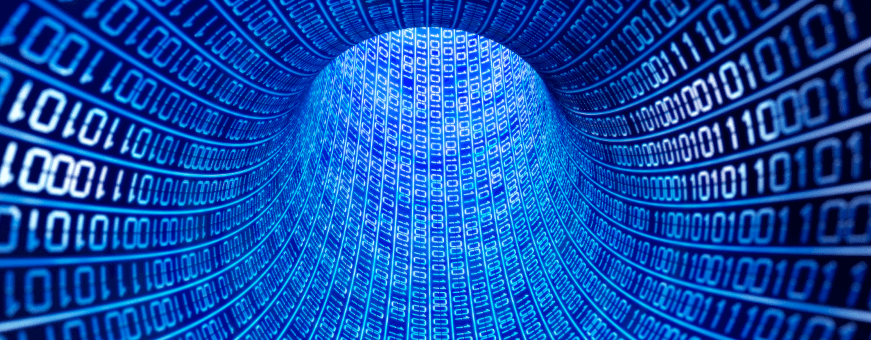
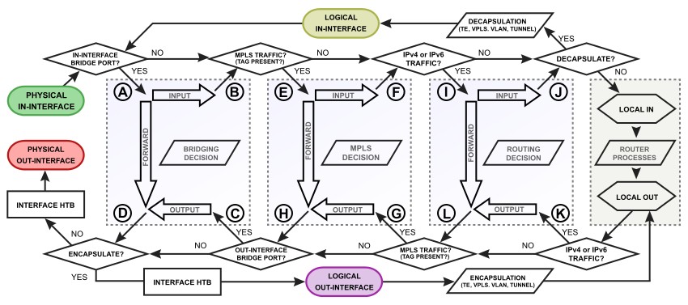

# Data Packets in Networking

  

Data packets are the fundamental units of data transmission across networks. They are small chunks of data sent from one device to another, broken down to ensure efficient transfer and reliable communication. Data packets are used in various protocols, including TCP/IP, to deliver information between devices.

## **What are Data Packets?**

A data packet is a unit of data that is transmitted over a network. It consists of two main components:

- **Header**: Contains information like the source and destination addresses, packet sequence, and error-checking data.
- **Payload**: The actual data being transmitted (e.g., part of a file, a message, or a webpage request).

### **Key Elements of a Data Packet:**
- **Source and Destination Address**: Identifies where the packet is coming from and where it’s going.
- **Sequence Number**: Ensures the correct order of packets when reassembled.
- **Checksum**: Used for error-checking to ensure data integrity.
- **Protocol**: Specifies which protocol is being used for communication (e.g., TCP, UDP).

## **How Data Packets Work**

  

When data is transmitted across a network, it is divided into smaller packets. Each packet contains enough information to be reassembled on the receiving end in the correct order.

1. **Data Creation** – An application generates data that needs to be transmitted.
2. **Packetization** – The data is divided into smaller packets by the transport layer (TCP or UDP).
3. **Routing** – Packets are routed across the network, possibly taking different paths, based on the destination address.
4. **Reception and Reassembly** – The receiving device reassembles the packets in the correct order.

## **Common Protocols Involved in Data Packet Transmission**

### **1. TCP (Transmission Control Protocol)**
TCP ensures reliable, ordered delivery of data packets. It handles error checking and reassembly of packets in the correct order.

### **2. UDP (User Datagram Protocol)**
UDP, unlike TCP, does not guarantee delivery or order. It is faster but less reliable, suitable for applications like streaming and gaming where speed is prioritized over accuracy.

## **Examples of Data Packet Creation and Transmission**

### **Python Example**

In Python, data packets are commonly sent using libraries like `socket`:

```python
import socket

# Create a UDP socket
sock = socket.socket(socket.AF_INET, socket.SOCK_DGRAM)

# Send a packet to the server
server_address = ('localhost', 12345)
message = b'This is a data packet'
sock.sendto(message, server_address)
```

### **JavaScript Example**

In JavaScript, WebSockets can be used to send data packets between a client and server:

```javascript
const socket = new WebSocket('ws://localhost:8080');

socket.onopen = function() {
    socket.send('This is a data packet');
};
```

### **C Example**

In C, data can be transmitted using sockets for both TCP and UDP:

```c
#include <stdio.h>
#include <string.h>
#include <arpa/inet.h>

int main() {
    int sock;
    struct sockaddr_in server;
    char message[] = "This is a data packet";

    sock = socket(AF_INET, SOCK_DGRAM, IPPROTO_UDP);
    server.sin_family = AF_INET;
    server.sin_port = htons(12345);
    server.sin_addr.s_addr = inet_addr("127.0.0.1");

    sendto(sock, message, strlen(message), 0, (struct sockaddr*)&server, sizeof(server));
    close(sock);
    return 0;
}
```

## **Best Practices for Working with Data Packets**

- **Use Error Checking** – Always use protocols like TCP that provide built-in error checking to ensure data integrity.
- **Optimize Packet Size** – Too large packets can cause network congestion, while very small packets might lead to overhead.
- **Compression** – Compress data to reduce the size of the packets, especially for large files or data streams.

## **Additional Resources**

### Informative Video

Learn more about how data packets work in networking.

[](https://www.youtube.com/watch?v=KUmdNpJmT0I)

### Articles

1. **[What is a Packet? | Cloudflare](https://www.cloudflare.com/en-gb/learning/network-layer/what-is-a-packet/)**  
2. **[Packet Definition | TechTarget](https://www.techtarget.com/searchnetworking/definition/packet)**  
3. **[What is a Data Packet? | NordVPN](https://nordvpn.com/cybersecurity/glossary/data-packet/)**  

By understanding data packets and how they are transmitted, developers and network engineers can ensure more efficient, reliable, and secure communication in networking systems.
