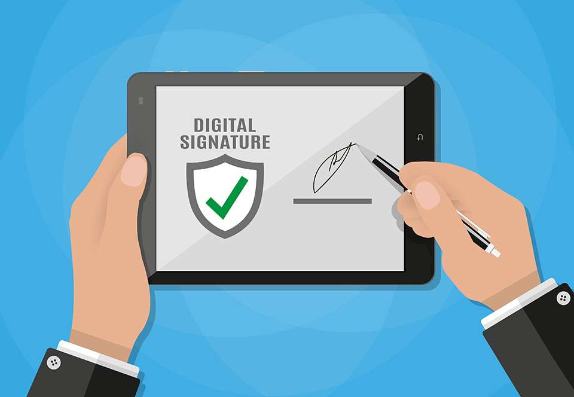
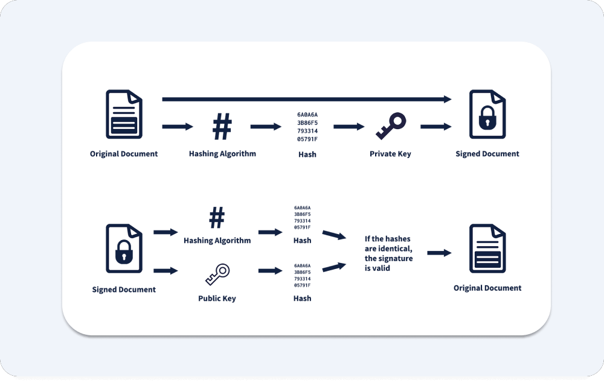
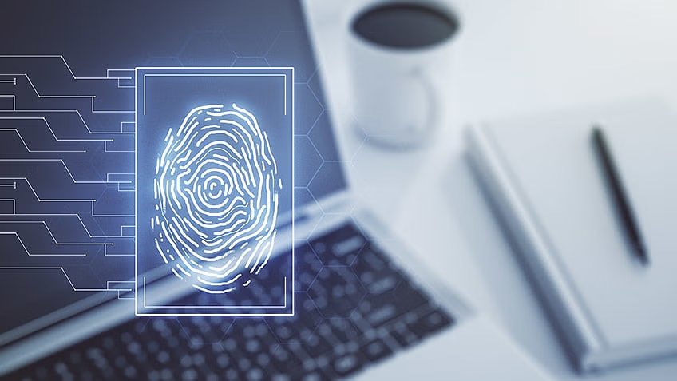

# Digital Signatures

  

A **digital signature** is a cryptographic mechanism used to verify the authenticity, integrity, and origin of digital messages or documents. It serves as a digital equivalent of a handwritten signature or a notarized seal, ensuring that data has not been altered and comes from a trusted source.  

## **How Digital Signatures Work**

  

Digital signatures rely on asymmetric cryptography, using a **public-private key pair** to sign and verify data.  

### **Steps in the Digital Signing Process**
1. **Hashing the Data** – The original message or document is passed through a cryptographic hash function, creating a fixed-length hash value.
2. **Signing the Hash** – The sender encrypts the hash using their **private key**, creating the digital signature.
3. **Transmitting the Data** – The message and its digital signature are sent to the recipient.
4. **Verification** – The recipient decrypts the signature using the sender’s **public key** and compares the resulting hash with a newly computed hash of the received data. If they match, the signature is valid.  

## **Key Properties of Digital Signatures**

  

1. **Authentication** – Confirms the identity of the sender.
2. **Integrity** – Ensures that the message has not been tampered with.
3. **Non-Repudiation** – Prevents the sender from denying their signature.  

## **Common Digital Signature Algorithms**

  

### **1. RSA (Rivest-Shamir-Adleman)**
- Uses a public-private key pair for signing and verification.
- Based on the difficulty of factoring large prime numbers.
- Commonly used in **SSL/TLS certificates, email encryption, and software validation**.

### **2. DSA (Digital Signature Algorithm)**
- Designed by the U.S. government for secure authentication.
- Uses modular exponentiation and discrete logarithms.
- Commonly used in **government and financial institutions**.

### **3. ECDSA (Elliptic Curve Digital Signature Algorithm)**
- A variant of DSA that uses **elliptic curve cryptography**.
- Provides the same level of security as RSA with smaller key sizes.
- Commonly used in **blockchain, cryptocurrencies, and secure communications**.

## **Applications of Digital Signatures**

  

- **Email Security (PGP, S/MIME)** – Ensures emails are authentic and untampered.
- **Software Distribution** – Verifies the authenticity of software updates.
- **Blockchain & Cryptocurrencies** – Used in Bitcoin and Ethereum transactions.
- **Legal Documents & Contracts** – Provides legally binding electronic signatures.
- **SSL/TLS Certificates** – Secure HTTPS connections for websites.

## **Example: Digital Signature in Python**
```python
from cryptography.hazmat.primitives.asymmetric import rsa, padding
from cryptography.hazmat.primitives import hashes

# Generate RSA key pair
private_key = rsa.generate_private_key(public_exponent=65537, key_size=2048)
public_key = private_key.public_key()

# Message to sign
message = b"Secure message"

# Sign the message
signature = private_key.sign(
    message,
    padding.PSS(
        mgf=padding.MGF1(hashes.SHA256()),
        salt_length=padding.PSS.MAX_LENGTH
    ),
    hashes.SHA256()
)

# Verify the signature
try:
    public_key.verify(
        signature,
        message,
        padding.PSS(
            mgf=padding.MGF1(hashes.SHA256()),
            salt_length=padding.PSS.MAX_LENGTH
        ),
        hashes.SHA256()
    )
    print("Signature is valid!")
except:
    print("Signature verification failed!")
```

## **Additional Resources**

### **Informative Video**
[](https://www.youtube.com/watch?v=GSIDS_lvRv4)  

### **Articles**
1. **[Digital Signatures and Certificates | Microsoft Support](https://support.microsoft.com/en-au/office/digital-signatures-and-certificates-8186cd15-e7ac-4a16-8597-22bd163e8e96)**  
2. **[Digital Signature | Wikipedia](https://en.wikipedia.org/wiki/Digital_signature)**  
3. **[Public Key Cryptography](https://www.khanacademy.org/computing/computers-and-internet/xcae6f4a7ff015e7d:online-data-security/xcae6f4a7ff015e7d:data-encryption-techniques/a/public-key-encryption)** – Khan Academy’s article explaining public-key cryptography and its role in digital signatures.
