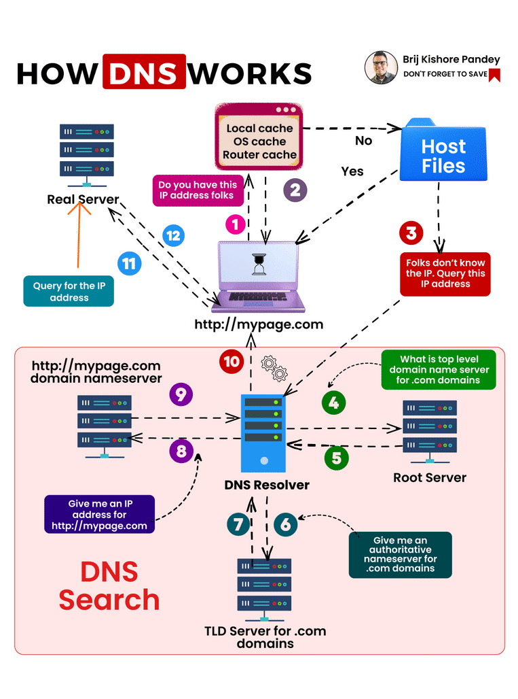

# Domain Name System (DNS)

  

The **Domain Name System (DNS)** is a hierarchical system that translates human-readable domain names (like `example.com`) into machine-readable IP addresses (like `192.168.1.1`). This system enables users to access websites without needing to remember complex numerical addresses.  

## How DNS Works  

  

When a user enters a website URL in a browser, the DNS resolution process takes place in several steps:

1. **User Request** – The user types `www.example.com` into the browser.  
2. **Recursive Query** – The browser contacts a DNS resolver (usually provided by the ISP).  
3. **Root Server Lookup** – The resolver queries a root DNS server, which directs it to the correct top-level domain (TLD) server (e.g., `.com`).  
4. **TLD Server Query** – The TLD server provides the authoritative DNS server responsible for `example.com`.  
5. **Authoritative Server Response** – The authoritative server returns the correct IP address to the resolver.  
6. **Website Access** – The browser connects to the IP address and loads the website.  

## Types of DNS Records  

  

### **1. A Record (Address Record)**  
Maps a domain name to an IPv4 address.  
**Example:**  
```bash
example.com -> 192.168.1.1
```

### **2. AAAA Record**  
Maps a domain name to an IPv6 address.  
**Example:**  
```bash
example.com -> 2001:db8::ff00:42:8329
```

### **3. CNAME Record (Canonical Name)**  
Aliases one domain name to another.  
**Example:**  
```bash
www.example.com -> example.com
```

### **4. MX Record (Mail Exchange)**  
Specifies mail servers for a domain.  
**Example:**  
```bash
example.com -> mail.example.com
```

### **5. TXT Record**  
Stores arbitrary text data, often used for verification.  
**Example:**  
```bash
v=spf1 include:_spf.google.com ~all
```

## DNS Caching and Performance  

  

- **Browser Cache** – Stores recently resolved DNS records locally.  
- **Operating System Cache** – The OS temporarily stores DNS lookups to reduce query times.  
- **ISP DNS Cache** – The Internet Service Provider caches DNS responses to improve speed and reduce server load.  

## Secure DNS (DNS over HTTPS & DNS over TLS)  

- **DNS over HTTPS (DoH)** – Encrypts DNS queries to prevent eavesdropping.  
- **DNS over TLS (DoT)** – Secures DNS queries using TLS encryption.  

## Configuring DNS on a Local Machine  

### **1. Check Current DNS Settings**  

```bash
# Linux/macOS
cat /etc/resolv.conf
```

```powershell
# Windows
ipconfig /all | findstr "DNS Servers"
```

### **2. Change DNS Server (Linux/macOS)**  

```bash
sudo nano /etc/resolv.conf
nameserver 8.8.8.8
nameserver 8.8.4.4
```

### **3. Change DNS Server (Windows)**  

```powershell
netsh interface ip set dns "Wi-Fi" static 8.8.8.8
```

## Additional Resources  

### Informative Video  
[](https://www.youtube.com/watch?v=NiQTs9DbtW4)  

### Articles  
1. **[Cloudflare’s Guide to DNS](https://www.cloudflare.com/learning/dns/what-is-dns/)** – A comprehensive explanation of DNS.  
2. **[Google’s Public DNS](https://developers.google.com/speed/public-dns)** – Learn about Google’s public DNS services.  
3. **[DNS Threat Reference](https://www.proofpoint.com/au/threat-reference/dns)**  