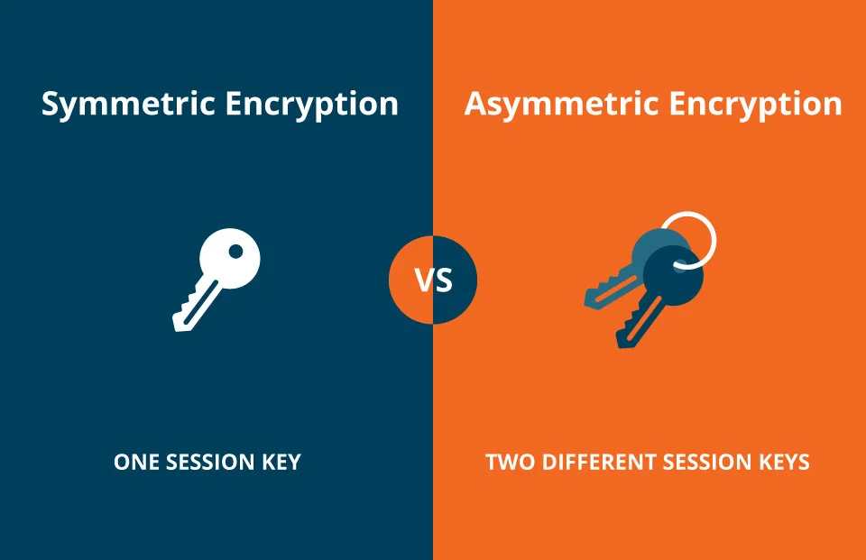

# Encryption Keys

  


Encryption keys are essential for securing data on a website, ensuring that sensitive information remains private and protected from unauthorized access. They are used in cryptographic algorithms to encrypt (scramble) and decrypt (unscramble) data, making it unreadable to anyone without the correct key. This is crucial for maintaining user privacy, preventing data breaches, and securing online transactions.  


## Types of Encryption Keys

  

### 1. Symmetric Keys
The same key is used for both encryption and decryption. This method is fast but requires secure key distribution.  

**Example:** AES (Advanced Encryption Standard).  

### **2. Asymmetric Keys**  
Uses a pair of keys:  
- **Public Key** – Used for encryption; can be shared openly.  
- **Private Key** – Used for decryption; must be kept secret.  

**Example:** RSA (Rivest-Shamir-Adleman), used in SSL/TLS for secure web connections.  

## **Where Encryption Keys Are Used in Web Development**


- **HTTPS (SSL/TLS Certificates)** – Encrypts data between a user’s browser and a server to prevent interception (e.g., login credentials, payment info).  
- **User Authentication** – Securely stores and verifies passwords using hashing and encryption.  
- **API Security** – Protects API communication using key-based authentication methods like JWT (JSON Web Tokens).  
- **Database Encryption** – Encrypts stored data to protect against breaches.  

## **Key Management Best Practices**  
  

- Keys must be stored securely and never exposed in source code
- Key length should be appropriate for the security level required
- Regular key rotation helps maintain security
- Implement proper key management systems for enterprise applications

By implementing encryption keys properly, web developers can significantly enhance the security and privacy of their websites.


## Common implementations in different programming languages:

```javascript
// JavaScript using Web Crypto API
// Define an asynchronous function called generateKey
async function generateKey() {
    // Use the Web Crypto API to asynchronously generate a cryptographic key
    const key = await window.crypto.subtle.generateKey(
        {
            // Specify the algorithm details for the key generation
            name: "AES-GCM",  // AES-GCM (Advanced Encryption Standard Galois/Counter Mode) encryption algorithm
            length: 256       // Key length set to 256 bits
        },
        true,               // Indicate that the key is extractable (it can be exported)
        ["encrypt", "decrypt"]  // The key will be used for both encryption and decryption operations
    );
    
    // Return the generated cryptographic key
    return key;
}
```

```python
# Python using cryptography library
# Import the Fernet class from the cryptography.fernet module for symmetric encryption
from cryptography.fernet import Fernet

# Define a function to generate a cryptographic key and cipher suite
def generate_key():
    # Generate a random key for Fernet encryption
    key = Fernet.generate_key()
    # Create a cipher suite using the generated key
    cipher_suite = Fernet(key)
    # Return both the key and the cipher suite
    return key, cipher_suite

# Generate a key and cipher suite by calling the generate_key function
key, cipher_suite = generate_key()

# Encrypt the message "Secret message" using the cipher suite, converting the message to bytes
encrypted_data = cipher_suite.encrypt(b"Secret message")

```

```php
<?php
// PHP code for generating an RSA key pair using OpenSSL

// Define a function to generate a key pair (private and public keys)
function generateKeyPair() {
    // Configuration array for the key generation process
    $config = array(
        "digest_alg" => "sha512",              // Specify the digest algorithm (SHA-512)
        "private_key_bits" => 2048,            // Define the length of the private key in bits (2048 bits)
        "private_key_type" => OPENSSL_KEYTYPE_RSA // Specify the key type (RSA)
    );
    
    // Generate a new private and public key pair using the specified configuration
    $res = openssl_pkey_new($config);

    // Export the private key to the variable $privateKey
    openssl_pkey_export($res, $privateKey);

    // Retrieve the public key from the key pair and store it in $publicKey
    $publicKey = openssl_pkey_get_details($res)["key"];
    
    // Return an associative array containing the private and public keys
    return array(
        "private" => $privateKey,   // Return the private key
        "public" => $publicKey      // Return the public key
    );
}
?>


```

## Additional Resources

### Informative Video
Here is an informative video on encryption keys to help build your understanding.

[](https://www.youtube.com/watch?v=6-JjHa-qLPk)

### Articles
1. **[Cryptographic Keys 101: What They Are & How They Secure Data](https://www.thesslstore.com/blog/cryptographic-keys-101-what-they-are-how-they-secure-data/)** – This article offers a concise overview of cryptographic keys, explaining their role in data security and how they work in conjunction with encryption algorithms.

2. **[What is a Cryptographic Key? Keys and SSL Encryption](https://www.cloudflare.com/learning/ssl/what-is-a-cryptographic-key/)** – Cloudflare provides an in-depth explanation of cryptographic keys, discussing their function in securing data and their importance in SSL encryption.

3. **[Public Key Encryption](https://www.khanacademy.org/computing/computers-and-internet/xcae6f4a7ff015e7d:online-data-security/xcae6f4a7ff015e7d:data-encryption-techniques/a/public-key-encryption)** – Khan Academy offers a detailed article on public key encryption, covering how it utilizes key pairs for secure data transmission.

4. **[Encryption Keys and Surveillance](https://www.lawfaremedia.org/article/encryption-keys-and-surveillance)** – This piece explores the intersection of encryption keys and surveillance, discussing the challenges and implications of government access to encryption keys.
