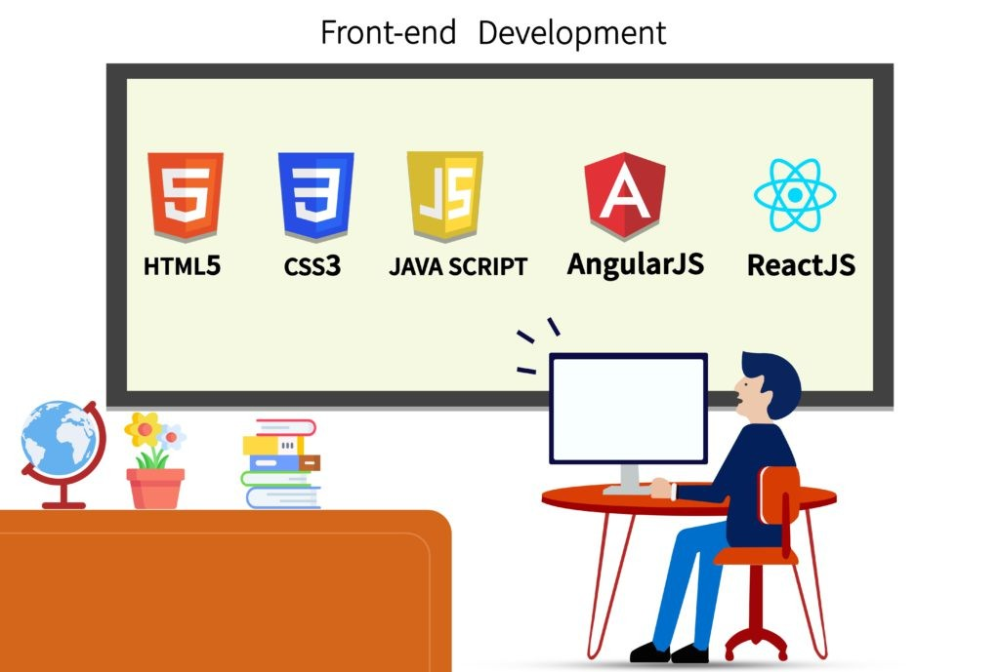
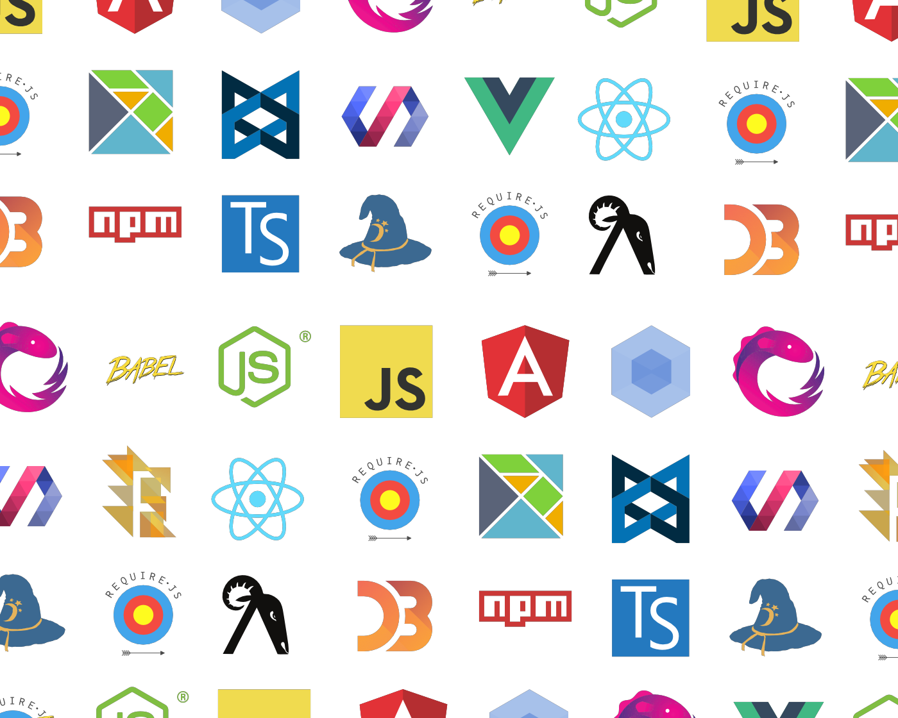
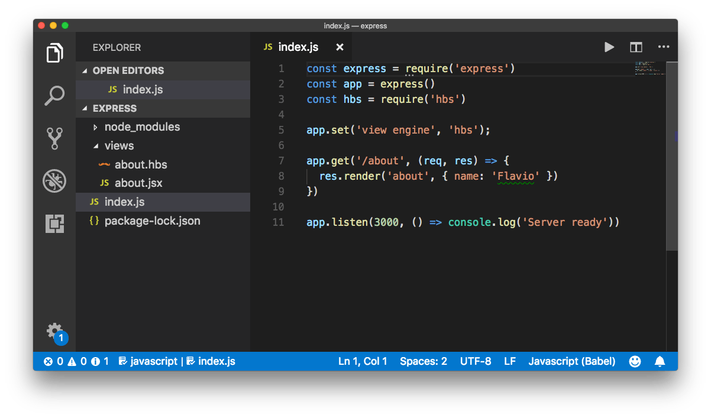

# Frontend Web Development



Frontend web development focuses on the part of web development that users interact with directly. It involves creating the layout, design, structure, and behavior of a website or web application using languages like HTML, CSS, and JavaScript. The goal is to build an intuitive, responsive, and visually appealing user interface.

## Key Technologies in Frontend Web Development

  

### 1. HTML (HyperText Markup Language)  
HTML is the foundation of web development, providing the structure for web pages. It defines elements like headings, paragraphs, links, and images.  

**Example:**  

```html
<!DOCTYPE html>
<html lang="en">
<head>
    <meta charset="UTF-8">
    <meta name="viewport" content="width=device-width, initial-scale=1.0">
    <title>Frontend Web Development</title>
</head>
<body>
    <h1>Welcome to Frontend Web Development</h1>
    <p>This is a simple webpage.</p>
</body>
</html>
```

### 2. CSS (Cascading Style Sheets)

CSS is used to style and layout web pages, such as changing fonts, colors, spacing, and positioning of elements. It also ensures that the website is responsive, meaning it adapts to different screen sizes.

**Example:**

```css
body { 
    font-family: Arial, sans-serif; 
    background-color: #f4f4f4; 
    color: #333; 
}

h1 { 
    color: #3498db; 
}
```

### 3. JavaScript

JavaScript is a programming language that adds interactivity to websites. It is used to update content dynamically, create animations, and handle user interactions.

**Example:**

```javascript
document.querySelector('button').addEventListener('click', function() {
    alert('Button clicked!');
});
```

### 4. Frameworks and Libraries

  

Frameworks and libraries are tools that help speed up the development process and provide solutions to common problems in frontend development.

- **React.js** – A JavaScript library for building user interfaces, primarily used for creating single-page applications (SPAs).
- **Vue.js** – A progressive JavaScript framework for building UIs and SPAs.
- **Angular** – A platform and framework for building single-page client applications using HTML and TypeScript.

## **Frontend Web Development Tools**

  

- **Text Editors** – Tools like Visual Studio Code, Sublime Text, and Atom are popular for writing code efficiently.
- **Version Control** – Git helps track changes in the code and collaborate with other developers. GitHub or GitLab are popular platforms for hosting repositories.
- **Package Managers** – Tools like npm (Node Package Manager) help manage libraries and dependencies.
- **Build Tools** – Webpack, Babel, and Gulp automate tasks like bundling and compiling code.

## **Best Practices in Frontend Development**

- **Responsive Design** – Ensure websites are usable on different devices by using CSS media queries and flexible grid layouts.
- **Performance Optimization** – Minimize CSS, JavaScript, and image files to reduce load times. Use lazy loading and image compression.
- **Accessibility** – Make sure your websites are accessible to people with disabilities by following accessibility guidelines and testing with screen readers.
- **Cross-Browser Compatibility** – Test your website on different browsers to ensure it works correctly everywhere.

By following these best practices and using modern tools and frameworks, frontend developers can create highly interactive, performant, and user-friendly websites.

## **Additional Resources**

### Informative Video

Here is an informative video on frontend web development to help build your understanding.

[](https://www.youtube.com/watch?v=3JluqTojuME)

### Articles

1. **[What is Frontend Development?](https://www.w3schools.com/whatis/whatis_frontenddev.asp)**
2. **[Frontend Developer Roadmap](https://roadmap.sh/frontend)**
3. **[How to Become a Front-End Developer](https://www.coursera.org/articles/front-end-developer)**