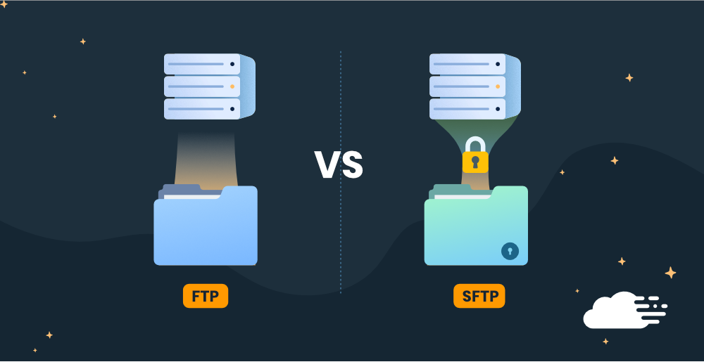

# File Transfer Protocol (FTP) vs Secure File Transfer Protocol (SFTP)

  

The **File Transfer Protocol (FTP)** and **Secure File Transfer Protocol (SFTP)** are both used for transferring files over a network, but they differ in security, authentication, and implementation. Understanding these differences is crucial for choosing the right method for secure and efficient file transfers.

## What is FTP?

  

FTP is a standard network protocol used to transfer files between a client and a server. It operates over **TCP/IP** and requires a connection to an FTP server for file uploads and downloads.

### **Key Features of FTP:**
- Uses **two communication channels** (command and data).
- Transfers files in **plain text**, making it vulnerable to interception.
- Requires a username and password for authentication.
- Often used in web development and file-sharing applications.

### **Common FTP Commands:**
```bash
ftp example.com
# Login with username and password
get filename.txt  # Download a file
put filename.txt  # Upload a file
ls                # List directory contents
bye               # Exit FTP session
```

## What is SFTP?

  

SFTP (Secure File Transfer Protocol) is a more secure alternative to FTP. It operates over **SSH (Secure Shell)** and encrypts all data transmissions, preventing unauthorized access and data breaches.

### **Key Features of SFTP:**
- Runs over **SSH (port 22)**, ensuring encrypted communication.
- Provides **strong authentication** (passwords, SSH keys, etc.).
- Encrypts both data and commands.
- Supports **resuming interrupted transfers** and **file integrity checks**.

### **Common SFTP Commands:**
```bash
sftp user@example.com
# Login with SSH authentication
get filename.txt  # Download a file
put filename.txt  # Upload a file
ls                # List directory contents
exit              # Exit SFTP session
```

## Key Differences Between FTP and SFTP

  

1. **Security:** FTP transfers files in plain text, making it vulnerable to attacks, while SFTP encrypts all data, commands, and authentication.
2. **Port Usage:** FTP operates on ports **20/21**, whereas SFTP uses **port 22** through SSH.
3. **Authentication:** FTP relies on username-password authentication in plain text, while SFTP supports secure authentication methods such as SSH keys.
4. **Performance:** FTP is generally faster since it lacks encryption overhead, but SFTP is more secure due to encryption.
5. **Use Cases:** FTP is suitable for non-sensitive file transfers, while SFTP is ideal for secure data transfer over untrusted networks.

## Configuring an SFTP Server

### **1. Install OpenSSH Server (Linux/macOS)**
```bash
sudo apt update && sudo apt install openssh-server -y
sudo systemctl enable ssh
sudo systemctl start ssh
```

### **2. Connect to SFTP Server**
```bash
sftp user@server_ip
```

### **3. Transfer Files Using SFTP**
```bash
put localfile.txt  # Upload file to server
get remotefile.txt # Download file from server
```

## Additional Resources  

### Informative Video  
[](https://www.youtube.com/watch?v=e5SkEgqIztU)  

### Articles  
1. **[Difference Between FTP and SFTP](https://www.techtarget.com/searchnetworking/definition/File-Transfer-Protocol-FTP)** – A breakdown of how FTP and SFTP work.
2. **[What is SFTP and How Are FTP, SFTP, SCP, and Rsync Different?](https://www.couchdrop.io/blog/what-is-sftp-and-how-are-ftp-sftp-scp-and-rsync-different#:~:text=SFTP%20vs%20FTP&text=SFTP%20requires%20authentication%20methods%20to,easier%20to%20intercept%20the%20data.)**  
3. **[SFTP vs FTP: Understanding the Difference](https://www.sharetru.com/blog/sftp-vs-ftp-understanding-the-difference)**  