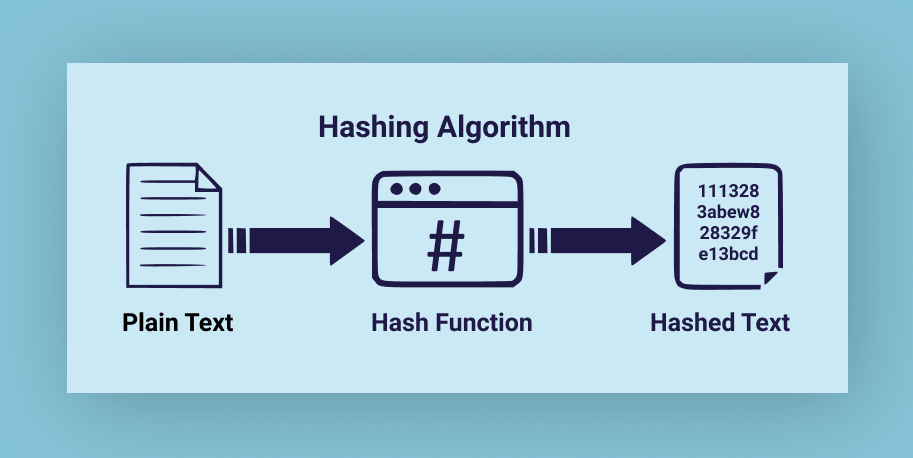
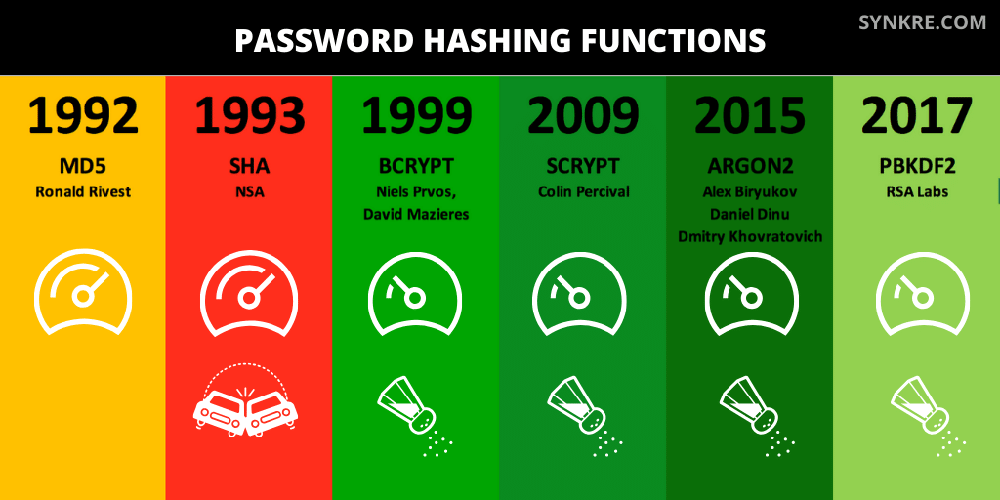
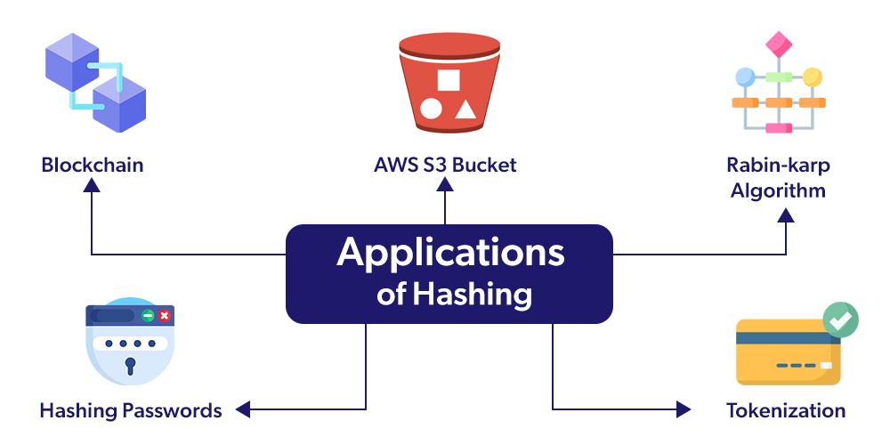

# Hash Values and Their Importance

  

A **hash value** (also known as a **digest**) is a unique, fixed-length string generated from an input data set using a cryptographic hash function. Hashing is an irreversible process unlike other forms of encryption such as a Caesar cipher. Hashing ensures data integrity and security by mapping data to a unique identifier. Even a small change in the input results in a completely different hash value.  

## **How Hashing Works**

  

A hash function takes an input (message, file, or password) and processes it to generate a fixed-length output, which acts as a digital fingerprint of the data.  

### **Key Properties of Hash Functions:**
- **Deterministic** – The same input always produces the same output.  
- **Fixed Size** – Regardless of input size, the output remains the same length.  
- **Fast Computation** – Efficiently computes hash values.  
- **Preimage Resistance** – Cannot reverse-engineer the original input from the hash.  
- **Small Changes = Huge Differences** – A minor input change significantly alters the hash (avalanche effect).  
- **Collision Resistance** – No two different inputs should produce the same hash.  

## **Common Hashing Algorithms**

  

### **1. MD5 (Message Digest Algorithm 5)**
- Produces a **128-bit hash** (32 hex characters).  
- **Fast** but prone to **collisions** (not secure for cryptographic use).  
- Example: `5d41402abc4b2a76b9719d911017c592` (hash of "hello").  

### **2. SHA-256 (Secure Hash Algorithm 256-bit)**
- Produces a **256-bit hash** (64 hex characters).  
- Used in **cryptography, digital signatures, and blockchain**.  
- Example: `2cf24dba5fb0a30e26e83b2ac5b9e29e1b161e5c1fa7425e73043362938b9824` (hash of "hello").

### **3. bcrypt**
- Designed for **password hashing** (includes a salt).  
- **Adaptive**: Can be configured to slow down brute-force attacks.  

## **Where Hashing is Used in Web Development**

  

- **Password Storage** – Hashes and salts passwords to protect user credentials.  
- **Data Integrity Verification** – Confirms that files and messages haven’t been tampered with.  
- **Digital Signatures** – Used in cryptographic verification and blockchain transactions.  
- **Checksum Validation** – Ensures data integrity in file transfers.  

## Common implementations in different programming languages:

```python
import hashlib

# Example string
message = "Hello, world!"

# MD5 Hash
md5_hash = hashlib.md5(message.encode()).hexdigest()
print("MD5:", md5_hash)

# SHA-256 Hash
sha256_hash = hashlib.sha256(message.encode()).hexdigest()
print("SHA-256:", sha256_hash)

# SHA-512 Hash
sha512_hash = hashlib.sha512(message.encode()).hexdigest()
print("SHA-512:", sha512_hash)
```

```javascript
const crypto = require('crypto');

// Example string
const message = "Hello, world!";

// MD5 Hash
const md5Hash = crypto.createHash('md5').update(message).digest('hex');
console.log("MD5:", md5Hash);

// SHA-256 Hash
const sha256Hash = crypto.createHash('sha256').update(message).digest('hex');
console.log("SHA-256:", sha256Hash);

// SHA-512 Hash
const sha512Hash = crypto.createHash('sha512').update(message).digest('hex');
console.log("SHA-512:", sha512Hash);
```

```java
import java.security.MessageDigest;
import java.security.NoSuchAlgorithmException;

public class HashExample {
    public static void main(String[] args) throws NoSuchAlgorithmException {
        String message = "Hello, world!";

        // MD5 Hash
        System.out.println("MD5: " + hash(message, "MD5"));

        // SHA-256 Hash
        System.out.println("SHA-256: " + hash(message, "SHA-256"));

        // SHA-512 Hash
        System.out.println("SHA-512: " + hash(message, "SHA-512"));
    }

    public static String hash(String input, String algorithm) throws NoSuchAlgorithmException {
        MessageDigest md = MessageDigest.getInstance(algorithm);
        byte[] digest = md.digest(input.getBytes());
        StringBuilder hexString = new StringBuilder();
        for (byte b : digest) {
            String hex = Integer.toHexString(0xff & b);
            if (hex.length() == 1) hexString.append('0');
            hexString.append(hex);
        }
        return hexString.toString();
    }
}
```

## **Additional Resources**  

### **Informative Video**  
[](https://www.youtube.com/watch?v=b4b8ktEV4Bg)  

### **Articles**  
1. **[How Password Hashing Works](https://www.owasp.org/index.php/Password_Storage_Cheat_Sheet)** – OWASP’s guide on securely storing passwords.  
2. **[Data Hashing | CrowdStrike](https://www.crowdstrike.com/en-us/cybersecurity-101/data-protection/data-hashing/)**  
3. **[What is Hashing? | Codecademy Blog](https://www.codecademy.com/resources/blog/what-is-hashing/)**  