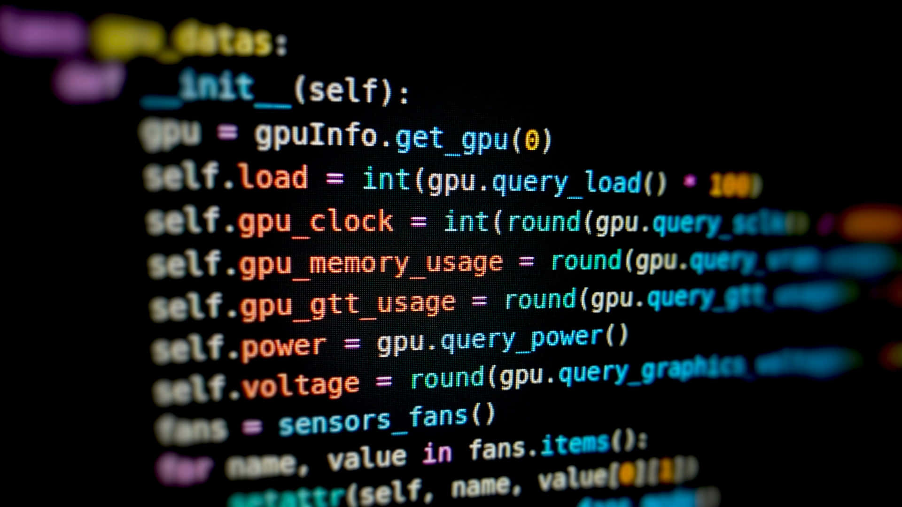

# Welcome to Dev.Dictionary

  

Dev.Dictionary is your ultimate resource for understanding software development terminology. Whether you're a beginner, a seasoned developer, or just someone curious about coding, this dictionary provides clear and concise definitions of the terms, acronyms, and jargon used in the tech industry.

From fundamental programming concepts to advanced software engineering methodologies, Dev.Dictionary simplifies complex ideas so you can focus on what matters—building great software. Whether you're learning a new programming language, diving into system architecture, or debugging an error message, having a reliable reference at your fingertips makes all the difference.

## Why Use Dev.Dictionary?
  

- **Comprehensive Coverage:** We include definitions across multiple domains, including web development, databases, DevOps, cybersecurity, and AI.
- **Beginner-Friendly:** Terms are explained in simple language with real-world examples to help you understand their application.
- **Regularly Updated:** The software world evolves rapidly, and so do we. Our dictionary is frequently updated with the latest terms and trends.
- **Cross-Referencing:** Many terms are interconnected, and we provide links between related definitions for deeper understanding.
- **Concise and Practical:** No lengthy textbook-style explanations—just the key information you need to understand the term and use it in real scenarios.

## Who Is Dev.Dictionary For?
  

- **Students & Beginners:** If you're learning to code, our easy-to-understand definitions will help you build a strong foundation.
- **Developers:** Whether you’re a frontend, backend, or full-stack developer, Dev.Dictionary helps you quickly look up unfamiliar terms.
- **IT Professionals:** System administrators, cybersecurity experts, and DevOps engineers can use this resource to clarify technical terminology.
- **Technical Writers & Educators:** Writing documentation or teaching programming? Dev.Dictionary provides precise definitions you can rely on.

## How to Use Dev.Dictionary
  

Looking up a term is easy. Use the search bar at the top of the page to find the definition you're looking for. You can also browse terms by category or check out our featured words of the day.

If you come across a word you don't understand while reading an article, debugging code, or participating in a tech discussion, just hop over to Dev.Dictionary. Our definitions are short, informative, and written to give you clarity in seconds.

## Start Exploring Today

  

Whether you're a coding newbie, an experienced software engineer, or just someone interested in tech, Dev.Dictionary is here to help you navigate the language of software development. Bookmark this site, use it as your reference, and never feel lost in tech jargon again.