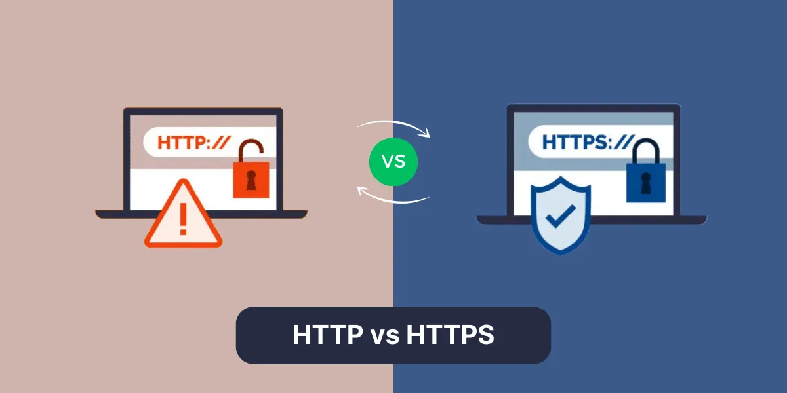
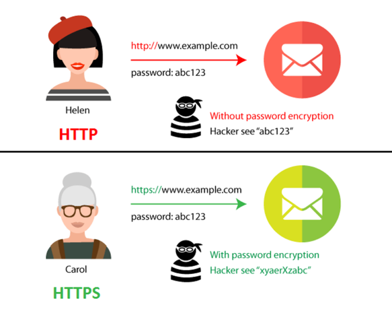
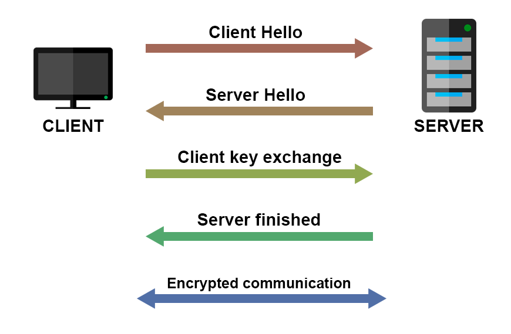
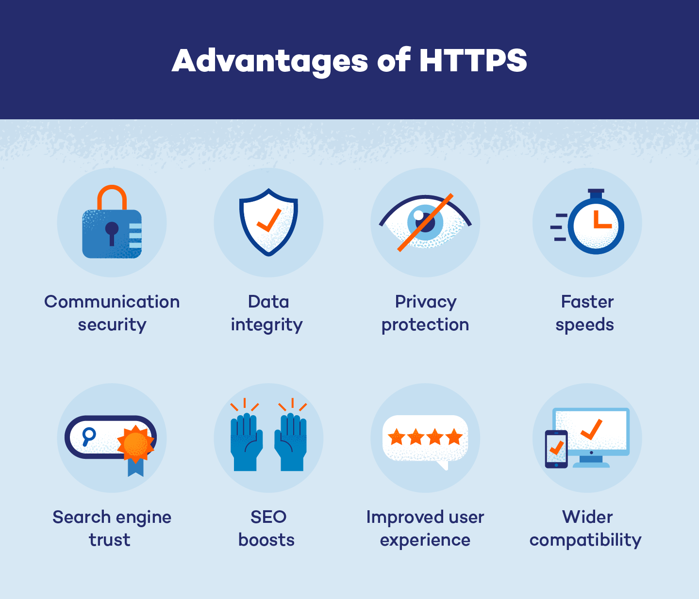

# HTTP vs HTTPS

  

HTTP (HyperText Transfer Protocol) and HTTPS (HyperText Transfer Protocol Secure) are protocols used for communication between a web browser and a website. While both facilitate the transfer of data, HTTPS provides additional security through encryption, making it the preferred choice for modern websites.  

## Key Differences Between HTTP and HTTPS  

  

### **1. Security**  
- **HTTP:** Data is transferred in plain text, making it vulnerable to interception and attacks.  
- **HTTPS:** Encrypts data using SSL/TLS, ensuring privacy and security.  

### **2. Data Integrity**  
- **HTTP:** Information can be altered by hackers during transmission.  
- **HTTPS:** Prevents data tampering and ensures the integrity of the content.  

### **3. SEO Benefits**  
- **HTTP:** Less secure websites rank lower in search results.  
- **HTTPS:** Google prioritizes HTTPS websites for better rankings.  

### **4. Authentication**  
- **HTTP:** No identity verification, making it susceptible to phishing.  
- **HTTPS:** Uses SSL/TLS certificates to confirm website authenticity.  

## How HTTPS Works  

  

HTTPS uses **SSL/TLS encryption** to secure data between the browser and the server. The process includes:

1. **SSL Handshake** – The server and client exchange encryption keys.  
2. **Data Encryption** – Secure communication is established using symmetric and asymmetric encryption.  
3. **Verification** – The SSL/TLS certificate confirms the identity of the website.  

## Implementing HTTPS  

### **1. Obtain an SSL/TLS Certificate**  

```bash
# Use Let's Encrypt to generate a free SSL certificate
sudo certbot --nginx -d yourdomain.com -d www.yourdomain.com
```

### **2. Configure HTTPS in Apache**  

```apache
<VirtualHost *:443>
    ServerName yourdomain.com
    SSLEngine on
    SSLCertificateFile /etc/letsencrypt/live/yourdomain.com/fullchain.pem
    SSLCertificateKeyFile /etc/letsencrypt/live/yourdomain.com/privkey.pem
</VirtualHost>
```

### **3. Redirect HTTP to HTTPS**  

```apache
<VirtualHost *:80>
    ServerName yourdomain.com
    Redirect permanent / https://yourdomain.com/
</VirtualHost>
```

## Benefits of Using HTTPS  

  

- **Enhanced Security** – Protects sensitive user data.
- **Improved SEO** – Boosts search engine rankings.
- **User Trust** – Displays a padlock symbol in the address bar.
- **Compliance with Standards** – Required for secure transactions.  

## Additional Resources  

### Informative Video  
[](https://www.youtube.com/watch?v=N_pSMHkubbY)  

### Articles  
1. **[Google’s Guide on HTTPS](https://web.dev/why-https-matters/)** – Explains the importance of HTTPS for web security.
2. **[Mozilla’s HTTPS Guide](https://developer.mozilla.org/en-US/docs/Web/HTTP/Overview#http_and_https)** – A detailed overview of HTTP and HTTPS.
3. **[The Difference Between HTTPS and HTTP](https://aws.amazon.com/compare/the-difference-between-https-and-http/)**  