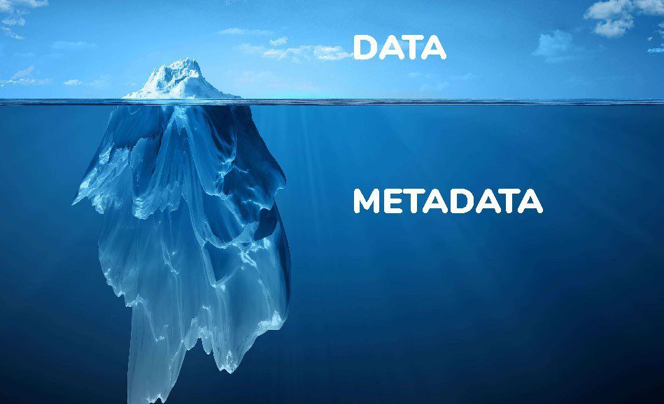

# Metadata in Digital Systems

  

Metadata is data that provides information about other data. It describes the attributes, characteristics, and structure of the data, helping to manage, discover, and organize content in digital systems. Metadata plays a key role in various fields such as web development, data storage, and digital media management.

## **What is Metadata?**

Metadata is essentially "data about data." It gives context to the data, making it easier to understand, locate, and use. Metadata can describe a variety of attributes, such as the author, date created, file size, and format of a digital file.

### **Key Types of Metadata:**
- **Descriptive Metadata**: Information that describes the content, such as title, author, or keywords.
- **Structural Metadata**: Details how the data is organized or formatted, like file format, table of contents, or page numbers.
- **Administrative Metadata**: Information about the management and preservation of the data, such as creation date, access rights, and file size.

## **Examples of Metadata**

  

- **Document Metadata**: For a Word document, metadata might include the document’s title, author, date created, and the software used.
- **Image Metadata**: For a photo, metadata might contain the camera settings, geolocation, date and time, and the photographer's name.
- **Webpage Metadata**: HTML meta tags provide metadata about a webpage, such as keywords, description, and author.

## **Applications of Metadata**

Metadata is used in many industries and applications, including:

- **Search Engines**: Metadata like keywords and descriptions help improve search results and SEO.
- **Digital Libraries and Archives**: Metadata is used to catalog and organize content in libraries, museums, and archives.
- **Multimedia**: For audio, video, and images, metadata contains details about the file's creation, format, and content.
- **Data Management**: Metadata is essential in databases to track the structure, relationships, and context of the stored data.

## **Metadata in Web Development**

### **HTML Metadata**
In web development, HTML provides `<meta>` tags to define metadata for a webpage. These tags help search engines index the page and determine its relevance.

**Example:**

```html
<head>
    <meta charset="UTF-8">
    <meta name="author" content="John Doe">
    <meta name="description" content="This is a sample webpage for learning metadata.">
    <meta name="keywords" content="HTML, metadata, web development">
    <meta name="viewport" content="width=device-width, initial-scale=1.0">
    <title>Sample Webpage</title>
</head>
```

## **Metadata in Data Management**

In databases, metadata describes the structure of the data, including table names, column types, and relationships between tables.

- **Data Dictionary**: A collection of metadata that defines the structure of the database, such as the types and constraints of the data fields.
- **Data Warehouse Metadata**: Describes the data stored in a data warehouse, including the sources, transformation processes, and storage details.

## **Best Practices for Managing Metadata**

- **Standardization**: Use consistent metadata standards to ensure interoperability across systems.
- **Accuracy**: Ensure metadata is accurate and up-to-date to provide meaningful context.
- **Accessibility**: Make metadata easily accessible to both users and systems for better data management and retrieval.
- **Security**: Protect metadata to prevent unauthorized access or modification, as it may contain sensitive information.

## **Additional Resources**

### Informative Video

Learn more about metadata and its applications in this informative video.

[](https://www.youtube.com/watch?v=rc0pXCh-2bE)

### Articles

1. **[Metadata | Australian Bureau of Statistics](https://www.abs.gov.au/statistics/understanding-statistics/statistical-terms-and-concepts/metadata#:~:text=Metadata%20is%20the%20information%20that,involved%20in%20the%20data%20collection.)**  
2. **[What is Metadata and Why is it Important? | Opendatasoft](https://www.opendatasoft.com/en/blog/what-is-metadata-and-why-is-it-important-data/)**  
3. **[What is Metadata? | Spiceworks](https://www.spiceworks.com/tech/devops/articles/what-is-metadata/)**  
4. 
By understanding metadata and how to use it effectively, individuals and organizations can manage data more efficiently and make it easier to locate and utilize in various applications.
