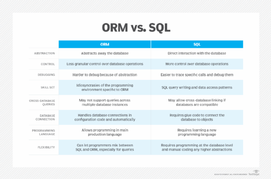

# ORM vs SQL: A Comparison

  

In modern software development, databases play a crucial role in managing application data. There are two primary approaches to working with databases: **Object-Relational Mapping (ORM)** and **SQL (Structured Query Language)**. Each has its advantages and disadvantages depending on the project requirements and developer preferences.

## **What is ORM?**

ORM is a programming technique that allows developers to interact with a relational database using high-level object-oriented programming languages. It abstracts the database interactions by mapping objects in the code to rows in database tables.

**Key Features:**
- **Abstraction** – Developers work with objects rather than SQL queries, simplifying database interactions.
- **Database Independence** – ORM allows the use of different databases without changing the application code.
- **Automatic CRUD Operations** – ORM frameworks often automate common database operations like Create, Read, Update, and Delete.

### **Popular ORM Frameworks:**
- **Hibernate** (Java)
- **Entity Framework** (C#)
- **Django ORM** (Python)
- **Rails ActiveRecord** (Ruby)

## **What is SQL?**

SQL is a standardized language used to manage and query data in relational databases. It allows developers to interact directly with the database using structured commands to retrieve, update, insert, and delete data.

**Key Features:**
- **Precision** – SQL gives developers direct control over database queries and operations, allowing for fine-tuned optimizations.
- **Database-Specific Optimization** – Developers can leverage the specific features and optimizations of the database engine they are working with.
- **Flexibility** – SQL provides full flexibility in writing custom queries, including complex joins, aggregations, and subqueries.

### **Common SQL Databases:**
- **MySQL**
- **PostgreSQL**
- **SQL Server**
- **SQLite**

## **ORM vs SQL: Key Differences**

  

### 1. **Ease of Use**

- **ORM**: ORM provides a higher-level abstraction, making it easier for developers to interact with the database by writing object-oriented code. It simplifies common database operations like CRUD.
- **SQL**: SQL requires a deeper understanding of the database schema and language syntax. It is more flexible but requires more code and knowledge of SQL queries.

### 2. **Performance**

- **ORM**: While ORM frameworks can speed up development, they sometimes introduce performance overhead due to the abstraction layer. Complex queries may be less optimized than custom SQL.
- **SQL**: SQL gives developers full control over performance optimizations. With SQL, complex queries can be fine-tuned for maximum efficiency.

### 3. **Control Over Queries**

- **ORM**: ORM automatically generates SQL queries behind the scenes, which may not always be the most efficient or optimized. Developers may not have full control over how the database queries are executed.
- **SQL**: SQL provides complete control over the structure and optimization of queries, allowing developers to fine-tune each operation.

### 4. **Maintainability**

- **ORM**: ORM frameworks often result in more maintainable code, as developers don’t have to write repetitive SQL statements. Code is more consistent and follows the object-oriented paradigm.
- **SQL**: Direct SQL queries can make the code more complex and harder to maintain, especially in large applications with many complex queries.

## **Advantages of ORM**

- **Faster Development**: ORM tools automate many common database operations, reducing the amount of code developers need to write.
- **Object-Oriented Approach**: ORM frameworks align with the object-oriented design, making it easier for developers to work with relational data in an object-oriented environment.
- **Database Independence**: ORM allows developers to change the underlying database system with minimal impact on the application code.

## **Advantages of SQL**

- **Full Control**: Developers can optimize SQL queries for specific use cases, ensuring that the database interaction is efficient.
- **Complex Queries**: SQL allows developers to write complex queries, joins, and subqueries that may be difficult to express using an ORM framework.
- **Performance**: SQL queries are often faster and more optimized because they are written specifically for the underlying database engine.

## **When to Use ORM vs SQL**

### Use **ORM** if:
- You are working with a simple to moderate database schema.
- You want to speed up development by automating common database operations.
- You need database-agnostic code that can be easily migrated to different database systems.

### Use **SQL** if:
- You need complete control over query performance and optimizations.
- Your application requires complex queries or intricate database operations.
- You are working with large datasets and need fine-tuned performance.

## **Additional Resources**

### Informative Video

Learn more about ORM and SQL and when to use each in this detailed video.

### Articles

1. **[ORM vs SQL: When to Use Each | TechTarget](https://www.techtarget.com/searchsoftwarequality/tip/ORM-vs-SQL-When-to-use-each)**  
2. **[SQL Tutorial | W3Schools](https://www.w3schools.com/sql/)**  
3. **[What is an ORM? | Prisma](https://www.prisma.io/dataguide/types/relational/what-is-an-orm#:~:text=An%20ORM%2C%20or%20Object%20Relational,used%20in%20object-oriented%20programming.)**  
   
By understanding the strengths and limitations of both ORM and SQL, developers can make informed decisions on which approach is best suited for their applications.
