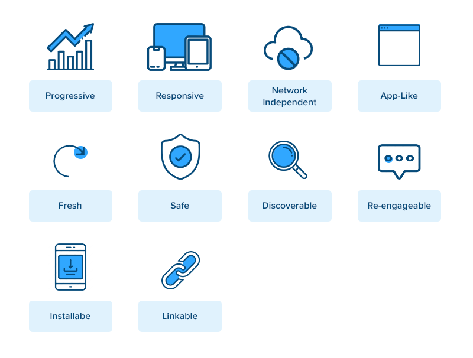
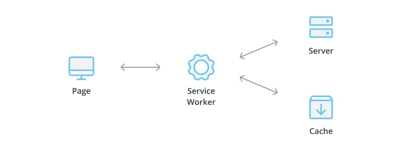
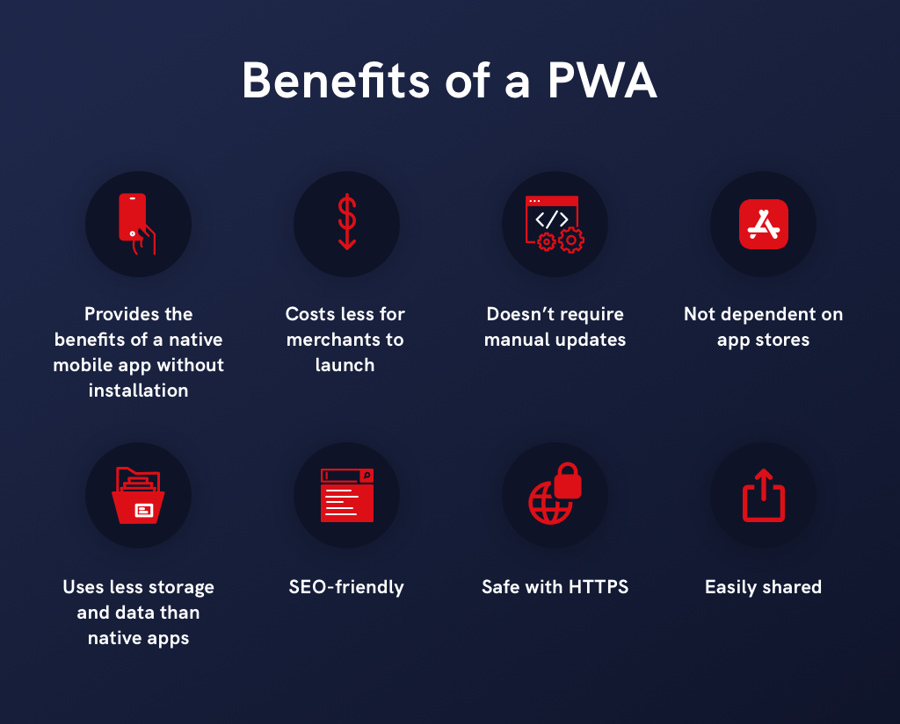

# Progressive Web Apps (PWAs)

  

Progressive Web Apps (PWAs) are web applications that use modern web capabilities to deliver an app-like experience to users. They combine the best features of web and mobile applications, allowing for offline usage, push notifications, and fast load times. PWAs are designed to be reliable, fast, and engaging, making them a powerful solution for web-based applications.  

## Key Features of PWAs  

  

### **1. Responsive Design**  
PWAs adapt seamlessly to different screen sizes, ensuring a smooth experience on desktops, tablets, and mobile devices.  

### **2. Offline Support**  
With the use of Service Workers, PWAs can cache content and function even when there is no internet connection.  

### **3. Push Notifications**  
PWAs support push notifications, allowing websites to engage users and keep them updated.  

### **4. Fast Load Speeds**  
By caching resources and optimizing performance, PWAs load quickly even on slow networks.  

### **5. Installable & App-Like Experience**  
PWAs can be installed on a user’s device and launched like a native app, without needing an app store.  

## How PWAs Work  

  

PWAs rely on three main components:

- **Service Workers** – JavaScript scripts running in the background, enabling offline capabilities and push notifications.  
- **Web App Manifest** – A JSON file that defines the app’s name, icon, theme color, and behavior when installed.  
- **HTTPS & Performance Optimization** – Ensuring security and speed using TLS encryption and caching techniques.  

## Setting Up a Basic PWA  

### **1. Create a Web App Manifest**  
```json
{
  "name": "My PWA",
  "short_name": "PWA",
  "start_url": "/index.html",
  "display": "standalone",
  "background_color": "#ffffff",
  "theme_color": "#000000",
  "icons": [
    {
      "src": "icon.png",
      "sizes": "192x192",
      "type": "image/png"
    }
  ]
}
```

### **2. Register a Service Worker**  
```javascript
if ('serviceWorker' in navigator) {
  window.addEventListener('load', function() {
    navigator.serviceWorker.register('/service-worker.js').then(function(registration) {
      console.log('Service Worker registered with scope:', registration.scope);
    }, function(err) {
      console.log('Service Worker registration failed:', err);
    });
  });
}
```

### **3. Implement the Service Worker**  
```javascript
self.addEventListener('install', function(event) {
  event.waitUntil(
    caches.open('pwa-cache').then(function(cache) {
      return cache.addAll([
        '/',
        '/index.html',
        '/styles.css',
        '/script.js'
      ]);
    })
  );
});

self.addEventListener('fetch', function(event) {
  event.respondWith(
    caches.match(event.request).then(function(response) {
      return response || fetch(event.request);
    })
  );
});
```

## Benefits of PWAs  

  

- **Cross-Platform Compatibility** – Works across all devices with a single codebase.
- **No App Store Dependence** – Users can install PWAs directly from the browser.
- **Lower Development Costs** – Eliminates the need for separate native apps.
- **Improved Performance** – Faster than traditional web apps due to caching and optimizations.  

## Additional Resources  

### Informative Video  
[](https://www.youtube.com/watch?v=BByUknfLTuA)  

### Articles  
1. **[Google's Guide to PWAs](https://web.dev/progressive-web-apps/)** – A detailed guide to building PWAs with best practices.
2. **[MDN Web Docs on Service Workers](https://developer.mozilla.org/en-US/docs/Web/API/Service_Worker_API)** – An in-depth look at Service Workers and their role in PWAs.
4. **[Progressive Web Apps in Microsoft Edge](https://learn.microsoft.com/en-us/microsoft-edge/progressive-web-apps-chromium/)**  