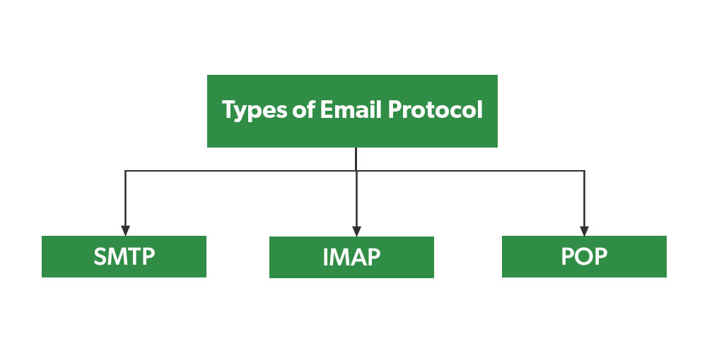
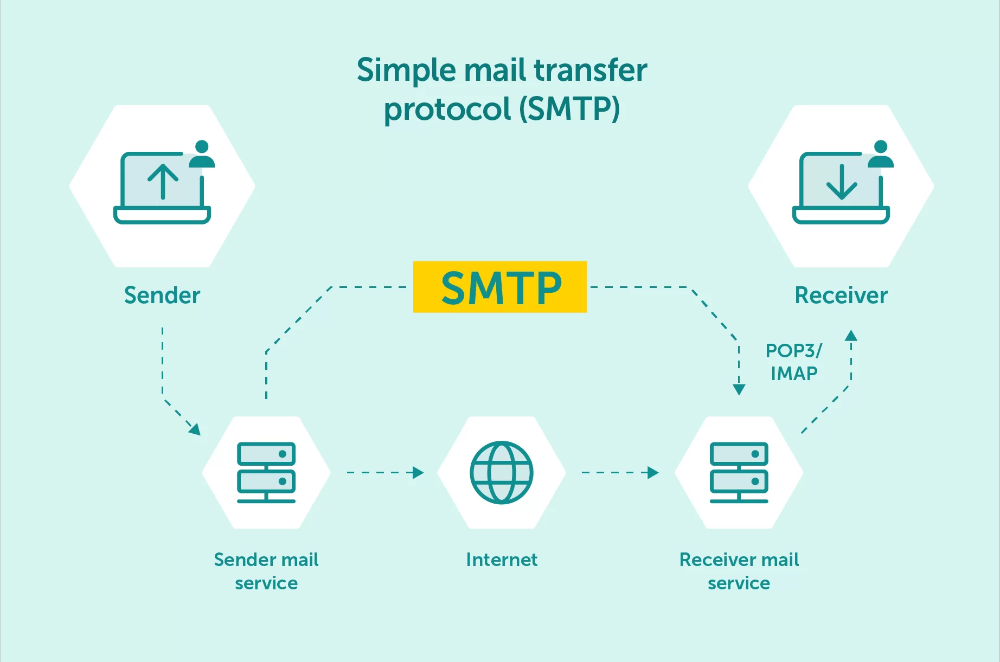
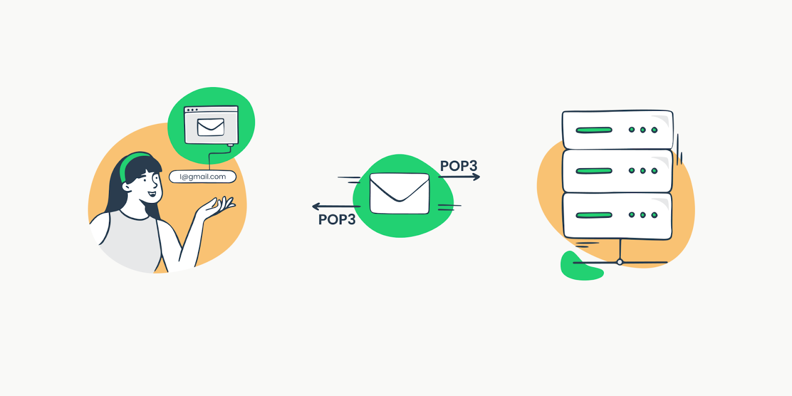
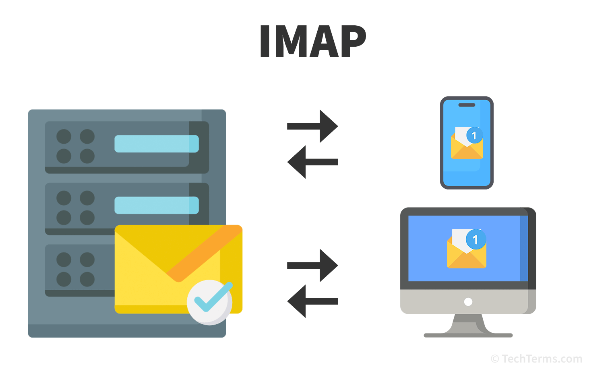

# SMTP vs. POP3 vs. IMAP

  

Email communication relies on specific protocols to send and receive messages. SMTP, POP3, and IMAP are the three main protocols used for email transmission and retrieval.

## **SMTP (Simple Mail Transfer Protocol)**

  

SMTP is responsible for sending emails from a client to a mail server or between mail servers.

### **Key Features:**
- Used for **outgoing** email.
- Works with TCP port **25**, **465** (SSL), or **587** (TLS).
- Requires authentication for secure email transmission.
- Cannot retrieve emails from a mailbox.

### **Example Workflow:**
1. A user composes an email in a client (e.g., Outlook, Gmail).
2. SMTP sends the email to the mail server.
3. The recipient’s server receives the email for delivery.

**Example SMTP Commands:**
```plaintext
HELO mail.example.com
MAIL FROM:<sender@example.com>
RCPT TO:<recipient@example.com>
DATA
Subject: Test Email
Hello, this is a test email!
.
QUIT
```

## **POP3 (Post Office Protocol 3)**

  

POP3 is used to retrieve emails from a mail server and store them locally.

### **Key Features:**
- Used for **incoming** email.
- Works with TCP port **110** (default) or **995** (SSL/TLS).
- Downloads emails from the server to the local device.
- Deletes emails from the server after download (default behavior).
- Limited synchronization across multiple devices.

### **Example Workflow:**
1. A user’s email client connects to the mail server.
2. POP3 downloads all emails to the local device.
3. Emails are removed from the server (unless configured to keep copies).

## **IMAP (Internet Message Access Protocol)**

  

IMAP allows users to access and manage emails directly on the mail server without downloading them permanently.

### **Key Features:**
- Used for **incoming** email.
- Works with TCP port **143** (default) or **993** (SSL/TLS).
- Emails remain on the server, enabling access from multiple devices.
- Synchronizes changes across all devices.
- Supports folder organization and message flagging.

### **Example Workflow:**
1. A user connects to their email account from a webmail client or app.
2. IMAP synchronizes emails, folders, and statuses in real time.
3. Emails remain on the server unless manually deleted.

## **SMTP vs. POP3 vs. IMAP: When to Use Which?**

SMTP, POP3, and IMAP serve different roles in email communication. Understanding their differences helps users choose the right protocol based on their needs.

- **Use SMTP** when sending emails. It handles outgoing mail transmission but does not retrieve messages.
- **Use POP3** if you want to download emails to a single device and prefer offline access. However, this means emails may be deleted from the server.
- **Use IMAP** if you need to access and manage emails across multiple devices while keeping messages stored on the server for synchronization.

### **Key Differences:**
- **SMTP** is only for sending emails, while **POP3** and **IMAP** are for receiving.
- **POP3** downloads emails and removes them from the server (unless configured otherwise), while **IMAP** keeps emails on the server and syncs across devices.
- **IMAP** is better for multi-device access, whereas **POP3** is ideal for users who prefer offline email storage.

Choosing the right protocol depends on whether you prioritize offline access, server storage, or multi-device synchronization.

## **Additional Resources**

### Informative Video

Watch this video explaining email protocols in detail.

[](https://www.youtube.com/watch?v=IMLFrYqI-oQ)

### Articles

1. **[IMAP vs POP3 vs SMTP | Courier](https://www.courier.com/guides/imap-vs-pop3-vs-smtp)**  
2. **[Email Protocols: POP3, SMTP, IMAP | SiteGround](https://au.siteground.com/tutorials/email/protocols-pop3-smtp-imap/)**  
3. **[Mail Protocols Explained: SMTP, POP2, IMAP, EAS, and MAPI | Sectorlink](https://www.sectorlink.com/article/mail-protocols-explained-smtp-pop2-imap-eas-and-mapi)**  
   
By choosing the right email protocol, users can optimize their email experience based on their needs for storage, accessibility, and synchronization.
