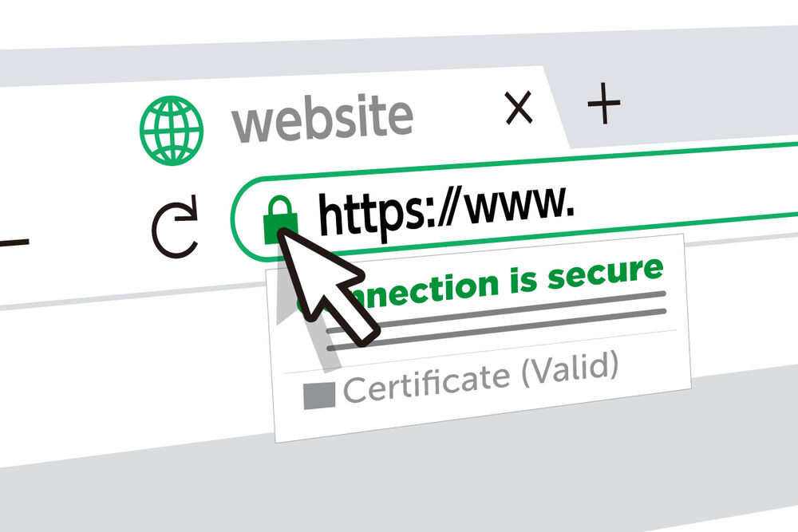
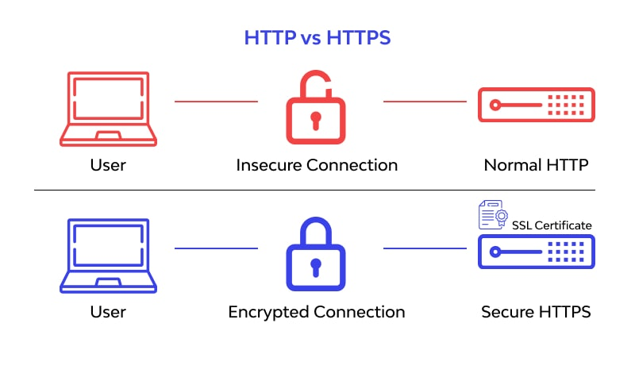
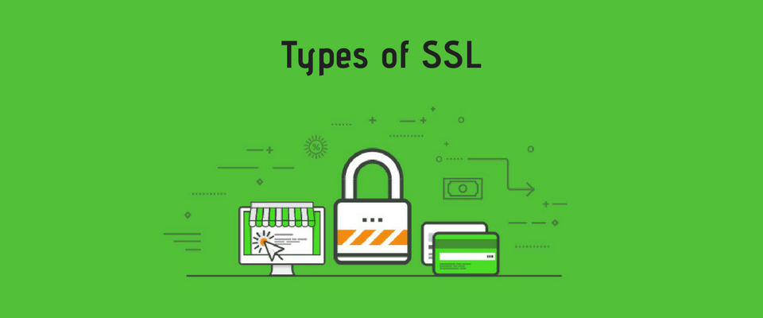
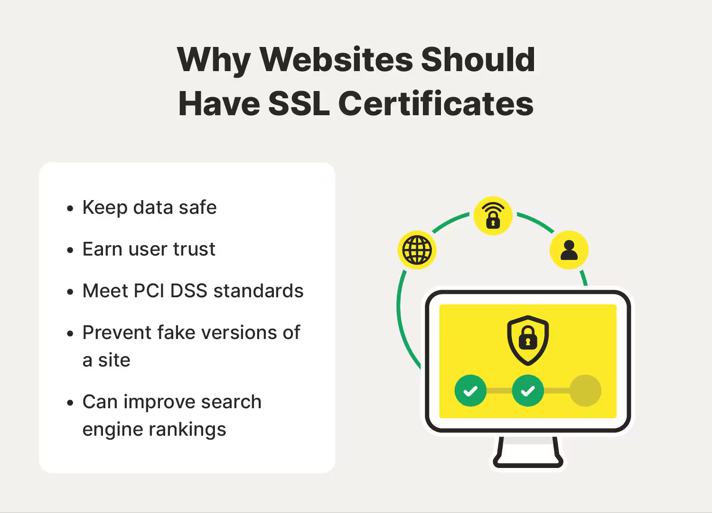

# SSL Certificates

  

SSL (Secure Sockets Layer) certificates are digital certificates that authenticate a website's identity and enable encrypted connections. They are essential for securing data transferred between a user's browser and a web server, ensuring privacy, data integrity, and security.

## **How SSL Certificates Work**

  

1. A browser requests a secure connection to a website.
2. The web server sends its SSL certificate to the browser.
3. The browser verifies the certificate's authenticity through a Certificate Authority (CA).
4. If valid, a secure encrypted session is established using **TLS (Transport Layer Security)**.
5. Data transmitted between the browser and server is encrypted, preventing interception or tampering.

## **Types of SSL Certificates**

  

### **1. Domain Validation (DV) SSL**
- Verifies domain ownership.
- Issued quickly and is the most basic level of SSL security.
- Example: Personal blogs, small websites.

### **2. Organization Validation (OV) SSL**
- Verifies both domain ownership and business identity.
- Requires manual validation by the Certificate Authority.
- Example: Business websites and e-commerce platforms.

### **3. Extended Validation (EV) SSL**
- Provides the highest level of authentication.
- Displays the company name in the browser's address bar.
- Example: Financial institutions, government websites.

### **4. Wildcard SSL**
- Secures a domain and all its subdomains.
- Example: `*.example.com` secures `blog.example.com`, `shop.example.com`, etc.

### **5. Multi-Domain SSL (SAN SSL)**
- Secures multiple domains under one certificate.
- Example: `example.com`, `example.net`, `example.org`.

## **Why SSL Certificates Are Important**

  

- **Encrypts sensitive data** – Prevents unauthorized access.
- **Authenticates websites** – Ensures users are communicating with the intended website.
- **Boosts SEO rankings** – Google prioritizes HTTPS-secured websites.
- **Builds trust** – Users see a padlock icon in the address bar, increasing confidence.
- **Protects against cyber threats** – Prevents **man-in-the-middle (MITM) attacks**.

## **Checking an SSL Certificate**

### **In a Web Browser**
- Click the **padlock icon** in the address bar.
- Select **Certificate (Valid)** to view details.

### **Using OpenSSL (Command Line)**
```bash
openssl s_client -connect example.com:443 -showcerts
```

## **How to Install an SSL Certificate**

### **1. Generate a CSR (Certificate Signing Request)**
```bash
openssl req -new -newkey rsa:2048 -nodes -keyout privatekey.key -out csr.csr
```

### **2. Obtain an SSL Certificate**
- Purchase from a **Certificate Authority (CA)** (e.g., DigiCert, Let's Encrypt, GlobalSign).
- Submit the CSR for validation.
- Receive and install the SSL certificate.

### **3. Install the SSL Certificate on a Web Server**
- **Apache:**
```bash
sudo a2enmod ssl
sudo systemctl restart apache2
```
- **Nginx:**
```bash
ssl_certificate /etc/ssl/certs/certificate.crt;
ssl_certificate_key /etc/ssl/private/privatekey.key;
```

## **Additional Resources**

### **Informative Video**  
[](https://www.youtube.com/watch?v=0yw-z6f7Mb4)  

### **Articles**
1. **[What is an SSL Certificate?](https://www.cloudflare.com/learning/ssl/what-is-an-ssl-certificate/)** – A comprehensive guide by Cloudflare.
2. **[The Difference Between SSL and TLS | AWS](https://aws.amazon.com/compare/the-difference-between-ssl-and-tls/)**  
3. **[What is SSL, TLS, and HTTPS? | DigiCert](https://www.digicert.com/what-is-ssl-tls-and-https)**  