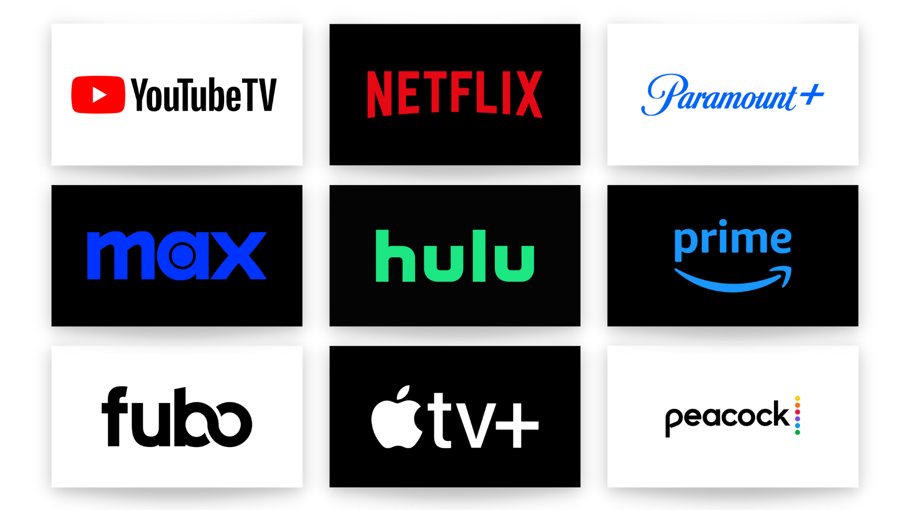
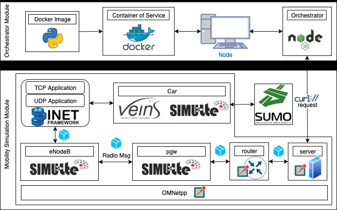
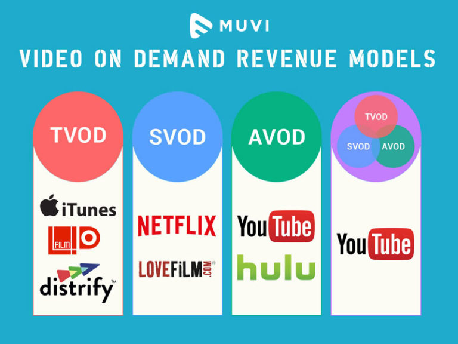
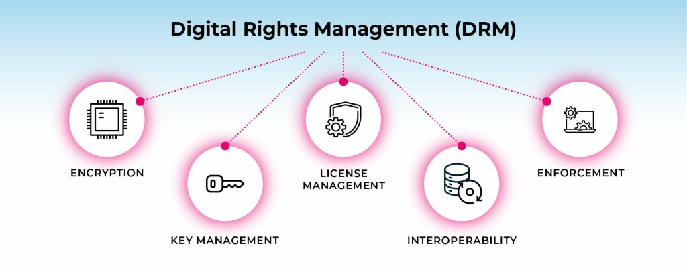
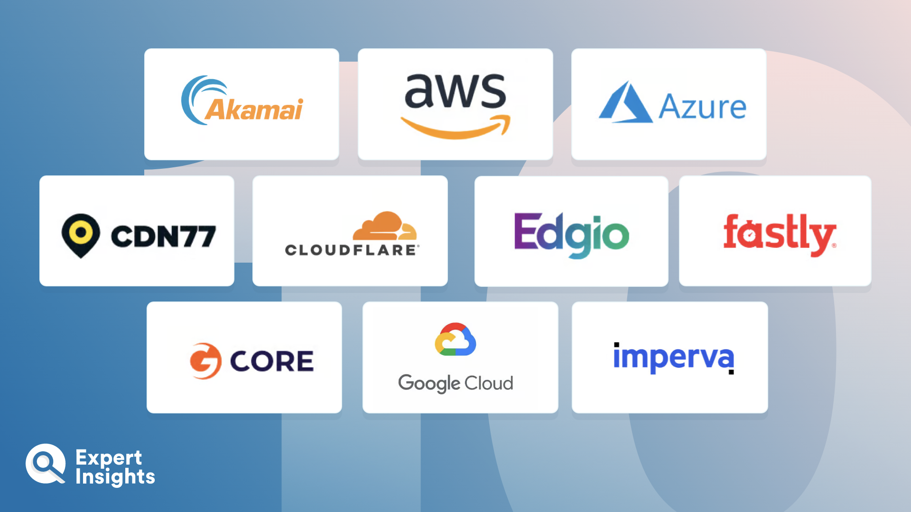

# Streaming Service Management  

  

Streaming service management involves overseeing the technical, operational, and content aspects of a digital streaming platform. This includes ensuring seamless content delivery, managing user subscriptions, optimizing performance, and handling licensing agreements. The goal is to provide a high-quality and uninterrupted streaming experience for users across various devices.  

## **Core Components of Streaming Service Management**  

  

### 1. Content Management  

Managing a streaming service starts with organizing and distributing media content efficiently. This involves:  

- **Content Acquisition** – Licensing movies, TV shows, or user-generated content.  
- **Metadata Management** – Ensuring accurate titles, descriptions, thumbnails, and categories.  
- **Content Delivery** – Using a Content Delivery Network (CDN) to stream videos with minimal buffering.  

**Example:** A platform like Netflix categorizes content by genre, region, and user preferences to optimize recommendations.  

### 2. Streaming Technology  

The backend infrastructure must support high-quality streaming with minimal latency.  

- **Adaptive Bitrate Streaming (ABR)** – Adjusts video quality based on internet speed.  
- **Video Encoding & Transcoding** – Converts media into formats compatible with different devices.  
- **Content Delivery Networks (CDNs)** – Distributes content globally for faster access.  

**Example:**  

```json
{
    "video_id": "12345",
    "format": ["1080p", "720p", "480p"],
    "cdn": "FastStreamCDN"
}
```  

### 3. Subscription & Monetization Models  

  

Streaming platforms use different business models to generate revenue:  

- **Subscription-based (SVOD)** – Users pay monthly (e.g., Netflix, Disney+).  
- **Ad-supported (AVOD)** – Free content with ads (e.g., YouTube, Pluto TV).  
- **Transactional (TVOD)** – Pay-per-view rentals (e.g., Apple TV, Google Play).  
- **Hybrid Models** – Combination of subscriptions and ads (e.g., Hulu).  

**Example:** A platform may offer a free ad-supported tier and a premium ad-free subscription.  

### 4. User Experience & Personalization  

Providing a smooth and engaging user experience is crucial. This includes:  

- **UI/UX Design** – Intuitive navigation and smart search functionality.  
- **Personalized Recommendations** – AI-driven algorithms suggest content based on viewing history.  
- **Multi-Device Compatibility** – Ensuring content plays on mobile, web, smart TVs, and gaming consoles.  

**Example:**  

```javascript
function getRecommendedContent(user) {
    return fetch(`/api/recommendations?user=${user}`)
        .then(response => response.json())
        .then(data => console.log("Recommended:", data));
}
```  

### 5. Security & Digital Rights Management (DRM)  

  

Protecting content from piracy and unauthorized access is essential.  

- **DRM (Digital Rights Management)** – Prevents unauthorized copying and distribution.  
- **Geo-Restrictions** – Limits content availability based on regions.  
- **User Authentication** – Secure login, two-factor authentication (2FA), and account protection.  

**Example:** Platforms use encryption and token-based authentication to secure video streams.  

## **Streaming Service Management Tools**  

  

- **Media Servers** – Tools like Wowza, AWS Media Services, and Vimeo OTT handle content streaming.  
- **Analytics & Performance Monitoring** – Services like Google Analytics, Conviva, and Datadog track user engagement and streaming performance.  
- **Cloud Storage & CDNs** – AWS S3, Akamai, and Cloudflare help store and distribute content efficiently.  
- **Billing & Subscription Management** – Stripe, Recurly, and Chargebee manage payments and renewals.  

## **Best Practices in Streaming Service Management**  

- **Optimize Content Delivery** – Use CDNs and adaptive bitrate streaming to reduce buffering.  
- **Enhance Security Measures** – Implement DRM and secure authentication to protect content.  
- **Improve User Engagement** – Leverage AI for content recommendations and interactive features.  
- **Ensure Scalability** – Use cloud-based infrastructure to handle traffic spikes and user growth.  
- **Regular Performance Monitoring** – Track load times, buffering rates, and uptime to enhance the viewing experience.  

By implementing these strategies and leveraging advanced technologies, streaming service providers can create a seamless and engaging experience for users worldwide.  

## **Additional Resources**  

### Informative Video  

Watch this video to understand how streaming services manage their operations effectively.  

[](https://www.youtube.com/watch?v=EbNCLMUNxUM)  

### Articles  

1. **[What is Adaptive Bitrate Streaming? | Cloudflare](https://www.cloudflare.com/en-gb/learning/video/what-is-adaptive-bitrate-streaming/)**  
2. **[Encrypted Media Extensions | W3C](https://www.w3.org/TR/encrypted-media/)**  
3. **[What is a CDN? | Cloudflare](https://www.cloudflare.com/en-gb/learning/cdn/what-is-a-cdn/)**  