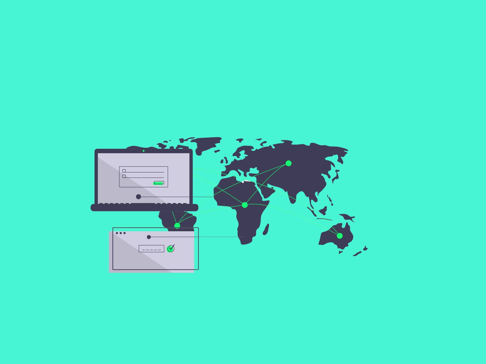
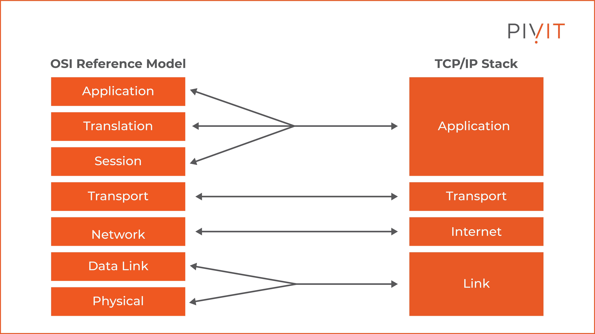

# TCP/IP Protocol Suite

  

The TCP/IP protocol suite is the fundamental communication model of the internet and modern networking. It defines how data is transmitted and received across networks, ensuring reliable communication between devices.

## **Layers of the TCP/IP Model**

   

### 1. Application Layer
This layer interacts directly with end-user applications, providing services like web browsing, email, and file transfers.

**Key Protocols:**
- **HTTP/HTTPS** – Web browsing
- **SMTP, POP3, IMAP** – Email communication
- **FTP, SFTP** – File transfers
- **DNS** – Domain name resolution

### 2. Transport Layer
Responsible for reliable data transfer, ensuring error checking, segmentation, and reassembly.

**Key Protocols:**
- **TCP (Transmission Control Protocol)** – Ensures reliable, ordered, and error-checked delivery.
- **UDP (User Datagram Protocol)** – Provides fast, connectionless communication without error checking.

**Example:**

```plaintext
TCP: Establishes a connection using a three-way handshake (SYN, SYN-ACK, ACK).
UDP: Sends data packets without establishing a prior connection.
```

### 3. Internet Layer
Handles logical addressing, routing, and packet forwarding across networks.

**Key Protocols:**
- **IP (Internet Protocol)** – Routes packets across networks (IPv4 & IPv6).
- **ICMP (Internet Control Message Protocol)** – Used for error messages and diagnostics (e.g., ping command).
- **ARP (Address Resolution Protocol)** – Resolves IP addresses to MAC addresses.

### 4. Network Access Layer
The lowest layer, responsible for physical transmission of data over network interfaces like Ethernet or Wi-Fi.

**Key Technologies:**
- **Ethernet** – Wired network communication
- **Wi-Fi** – Wireless network communication
- **MAC (Media Access Control) Addresses** – Unique hardware addresses for devices

## **TCP/IP Communication Process**

  

1. **Data Creation** – An application sends data (e.g., an email via SMTP).
2. **Segmentation (Transport Layer)** – TCP or UDP breaks data into packets.
3. **Packet Routing (Internet Layer)** – IP assigns source and destination addresses.
4. **Frame Encapsulation (Network Access Layer)** – Data is converted to electrical, radio, or optical signals for transmission.
5. **Data Transmission** – Data travels through routers and switches.
6. **Reception & Reassembly** – The receiving device reconstructs the original data.

## **TCP vs. UDP**

TCP is connection-oriented, ensuring reliable, ordered, and error-checked data transmission. It is used for applications like web browsing, email, and file transfers. UDP, on the other hand, is connectionless, offering faster communication without error checking, making it ideal for streaming, gaming, and VoIP.

## **Common Network Devices in a TCP/IP Network**

  

- **Router** – Directs data between networks.
- **Switch** – Connects devices in a local network and forwards data efficiently.
- **Firewall** – Protects the network by filtering incoming and outgoing traffic.
- **Modem** – Converts digital data for internet access via ISPs.

## **Best Practices for TCP/IP Network Security**

- **Use Firewalls & VPNs** – Secure network traffic from unauthorized access.
- **Implement Encryption (TLS/IPSec)** – Encrypt data in transit to prevent eavesdropping.
- **Monitor Network Traffic** – Use intrusion detection systems (IDS) for anomaly detection.
- **Regularly Update Devices & Firmware** – Patch security vulnerabilities in routers and network devices.

## **Additional Resources**

### Informative Video

Learn more about TCP/IP in this detailed video explanation.

[](https://www.youtube.com/watch?v=7LQjHM7TL5E)

### Articles

1. **[How the Internet Works](https://developer.mozilla.org/en-US/docs/Learn/Common_questions/How_does_the_Internet_work)** – Mozilla’s guide to understanding networking concepts.
2. **[TCP/IP Glossary | Fortinet](https://www.fortinet.com/resources/cyberglossary/tcp-ip#:~:text=The%20TCP%2FIP%20model%20defines,exchanged%20and%20organized%20over%20networks.)**  
3. **[TCP/IP Glossary | Cloudflare](https://www.cloudflare.com/en-gb/learning/ddos/glossary/tcp-ip/)**  

By understanding TCP/IP and its protocols, network administrators and users can ensure efficient and secure communication across the internet and local networks.

