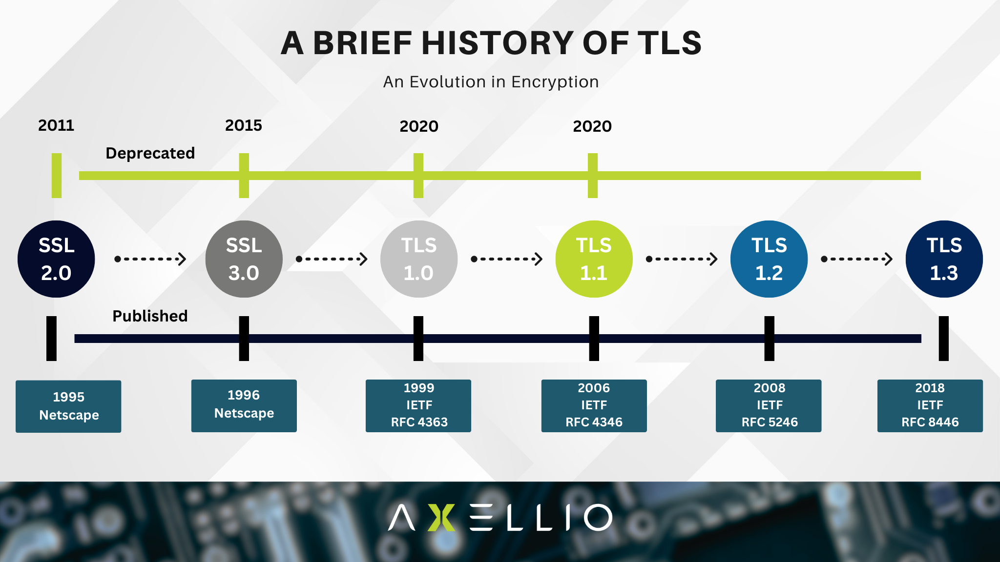

# Transport Layer Security (TLS)

  


Transport Layer Security (TLS) is a cryptographic protocol that ensures secure communication over a computer network. It is widely used in web browsers, email, instant messaging, and VoIP to provide privacy, data integrity, and authentication.

## **Key Features of TLS**

 

### 1. Encryption
TLS encrypts the data exchanged between client and server, preventing eavesdropping and unauthorized access. It supports symmetric encryption (e.g., AES) and asymmetric encryption (e.g., RSA, ECC).

**Example:**

```plaintext
Client encrypts message using AES-256
Server decrypts using the shared secret key
```

### 2. Authentication
TLS verifies the identity of the communicating parties using digital certificates issued by trusted Certificate Authorities (CAs).

**Example:**

```plaintext
Client requests server's TLS certificate
Server presents certificate issued by a CA
Client validates certificate and establishes trust
```

### 3. Data Integrity
TLS ensures that messages are not altered during transmission using cryptographic hash functions like SHA-256.

**Example:**

```plaintext
Sender generates a hash of the message
Receiver recalculates hash and compares it to detect tampering
```

## **TLS Handshake Process**

  

The TLS handshake is a sequence of steps that establish a secure connection between a client and a server.

### **Steps in the TLS Handshake:**
1. **Client Hello** – The client sends a message with supported TLS versions, cipher suites, and a random value.
2. **Server Hello** – The server responds with selected parameters and its own random value.
3. **Certificate Exchange** – The server presents its TLS certificate for authentication.
4. **Key Exchange** – The client and server exchange cryptographic keys for secure communication.
5. **Finished Message** – Both parties verify the handshake and establish a secure connection.

## **TLS Versions and Cipher Suites**

  

### **TLS Versions:**
- **TLS 1.0 & 1.1** (Deprecated) – Vulnerable to attacks like BEAST and POODLE.
- **TLS 1.2** – Introduced stronger encryption algorithms and improved security.
- **TLS 1.3** – Removes outdated ciphers, improves handshake speed, and enhances security.

### **Common Cipher Suites:**
- **TLS_AES_256_GCM_SHA384** (TLS 1.3)
- **ECDHE_RSA_WITH_AES_128_GCM_SHA256** (TLS 1.2)
- **ECDHE_ECDSA_WITH_AES_256_GCM_SHA384** (TLS 1.2)

## **TLS in Action**

### **Use in HTTPS**
TLS is essential for secure HTTPS connections, protecting data transmitted between web browsers and servers.

**Example:**

```plaintext
User visits https://example.com
TLS encrypts data to prevent interception
Secure padlock icon appears in the browser
```

### **Use in Email Security**
TLS secures email communication through protocols like SMTP, IMAP, and POP3, preventing email interception.

**Example:**

```plaintext
Email server enables STARTTLS for encryption
Emails are transmitted securely over the network
```

## **Best Practices for Implementing TLS**

- **Use TLS 1.2 or TLS 1.3** – Avoid outdated versions to mitigate vulnerabilities.
- **Enable Perfect Forward Secrecy (PFS)** – Protect past communications if keys are compromised.
- **Use Strong Cipher Suites** – Prefer AES-GCM and ChaCha20-Poly1305.
- **Regularly Update Certificates** – Prevent expired or weak certificates from weakening security.
- **Implement HTTP Strict Transport Security (HSTS)** – Force browsers to use HTTPS.

## **Additional Resources**

### Informative Video

Here is an informative video on TLS and its importance in cybersecurity.

[](https://www.youtube.com/watch?v=0TLDTodL7Lc)

### Articles
1. **[TLS 1.3 Overview](https://datatracker.ietf.org/doc/html/rfc8446)** – Official documentation on the latest TLS version.
2. **[Transport Layer Security (TLS) | Cloudflare](https://www.cloudflare.com/en-gb/learning/ssl/transport-layer-security-tls/)**  
3. **[Key Differences Between TLS 1.2 and TLS 1.3 | A10 Networks](https://www.a10networks.com/glossary/key-differences-between-tls-1-2-and-tls-1-3/)**  

By following best practices and staying updated with TLS advancements, organizations can ensure secure and encrypted communication across networks.

